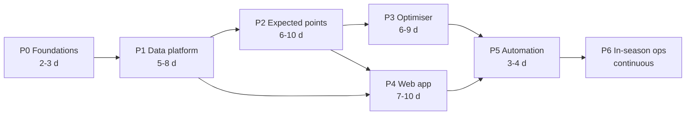

# Project Plan and Blueprint — FPL DOF

**Companion to:** [01-project-charter.md](01-project-charter.md) · **Baselined:** 2026-08-09

This document covers *how the thing gets built*: the blueprint that shapes the work, the season
operating calendar, and the RAID log. Architecture and component design live in documents 03 and 04.

> ### ⚠️ Which parts of this document are still current
>
> [DL-10](00-decision-log.md#dl-10--build-a-steel-thread-to-gw1-rather-than-deferring-the-build)
> replaced the phase plan with a steel thread plus eight epics. The **plan of record is now
> [docs/planning/epics/](epics/README.md)**.
>
> | Section | Status |
> | --- | --- |
> | §1 Blueprint (B1–B7) | **Current.** These principles govern the epics unchanged |
> | §2 Delivery strategy | **Current** in principle; the three workstreams now map onto epics rather than phases |
> | **§3 Phase plan (P0–P6)** | **Superseded** by the [epic register](epics/README.md#2-epic-register). Retained for the deliverable checklists inside each phase, which the epics reference but do not repeat |
> | **§4 Milestones (M0–M7)** | **Superseded.** Milestones are now epic exit criteria |
> | §5 Season operating calendar | **Current** |
> | §6 RAID log | **Current** — this is the live register |
> | **§7 The GW1 decision** | **Closed.** Resolved by DL-10 in favour of building. Rewritten below as a record of the choice |
> | **§8 Estimation summary** | **Superseded** by the epic register's 43–61 days |
> | §9 What good looks like | **Current** |

---

## 1. The blueprint

Seven principles. Every phase and every design choice downstream is answerable to them.

### B1 — The season is the clock

There is no sprint calendar. There are 38 deadlines, and the first is on **21 August 2026 at
18:30 BST**. Work is planned backwards from deadlines, and anything that cannot be finished before a
deadline is explicitly parked rather than half-built.

### B2 — Every phase exits usable

No phase ends with a half-connected system. Phase 1 ends with browsable data; phase 2 ends with a
usable expected-points table; phase 3 ends with a squad you could actually enter. This is the primary
defence against R-05 (stalling mid-build). A partially built system that still helps is a success; a
fully designed system that never ships is not.

### B3 — Precompute everything, serve static

The zero-cost constraint (DL-03) is not a limitation to work around, it is the design. Anything that
*can* be computed on a schedule *is* computed on a schedule and published as a file. Only genuinely
interactive exploration runs in the browser.

### B4 — Sources are plugins; the core knows nothing about them

Per DL-05. Ingestion is the only layer that knows a source exists. Everything downstream consumes a
conformed model. The test of this is mechanical: **adding a source must touch exactly one new adapter
module and one config entry.** If it touches anything else, the abstraction has failed.

### B5 — Predict, then optimise — never conflate the two

The expected-points engine answers "what is this player worth?" The optimiser answers "given those
values, what is the best legal set of decisions?" They are separate packages with a typed contract
between them. This keeps both testable, and it is what allows a stochastic layer to be swapped in
later without touching the solver (DL-06).

### B6 — Explainability is a feature, not documentation

The system's job is to make the owner a better manager, not to replace them. Every number the UI
shows must be traceable to its inputs, and every recommendation must show what it beat and by how
much. A recommendation that cannot be explained will not be trusted, and will not be followed.

### B7 — Validate before you believe

No model output is trusted until it has been backtested walk-forward against a held-out season and
beaten a naive benchmark. Building the optimiser on an unvalidated forecast is the fastest route to
confident, expensive, wrong decisions (R-04).

---

## 2. Delivery strategy

**Vertical slices, thin then thick.** Build the narrowest end-to-end path first — FPL API → conformed
table → naive forecast → static JSON → a table on a page — then thicken each layer in turn. This
surfaces integration problems in week one rather than week six.

**Three workstreams run in parallel** where dependencies allow:

| Stream | Covers | Runs |
| --- | --- | --- |
| **WS-A — Data platform** | Adapters, conformed model, entity resolution, quality gates, history backfill | Phases 0–1, then continuous maintenance |
| **WS-B — Intelligence** | Expected-points models, backtesting, optimiser, chip strategy, risk model | Phases 2–3, then continuous improvement |
| **WS-C — Product** | Web app, scouting, planner, explainability, PWA, data health | Phases 1–4, then continuous |

Cross-cutting concerns (orchestration, observability, testing, docs) are **not a stream and not a
phase**. They are built into every increment via the definition of done (charter §13). A project of
this size cannot afford an "add monitoring later" phase, because later never arrives.

---

## 3. Phase plan

Effort is in **focused build days** for a single AI-assisted maintainer — real elapsed time depends
entirely on availability. Phases are sequential in dependency, not necessarily in time.

---

> **Superseded — read [epics/](epics/README.md) for the plan of record.** The phase deliverables below
> remain a useful checklist of *what has to exist eventually*; the epics decide *when*.

### Phase 0 — Foundations · 2–3 days

**Goal:** a repository that can run one command end-to-end and prove the toolchain works.

| # | Deliverable |
| --- | --- |
| 0.1 | Git repository initialised; public/private decision taken (OD-01); `.gitignore`, licence, README |
| 0.2 | Python package skeleton with dependency and virtual-environment management, linting, formatting, type checking |
| 0.3 | Vite + React + TypeScript app skeleton that builds and serves |
| 0.4 | Layered configuration — defaults in the repo, secrets from environment, local overrides |
| 0.5 | Structured logging and the run-manifest primitive |
| 0.6 | FPL source adapter, first cut: `bootstrap-static` and `fixtures` only, writing raw snapshots |
| 0.7 | CI workflow: lint, type-check, test on every push |
| 0.8 | One published static JSON file rendered by the React app — **the walking skeleton** |

**Exit criteria:** `run ingest` on a clean checkout fetches live FPL data, writes a snapshot with a
manifest, and the web app displays something derived from it. CI is green.

**Risks addressed:** integration risk, toolchain risk on Windows.

---

### Phase 1 — Data platform · 5–8 days

**Goal:** a trustworthy conformed dataset covering current and historical seasons.

| # | Deliverable | Requirements |
| --- | --- | --- |
| 1.1 | Complete the FPL adapter: element summaries, live gameweek stats, entry/picks/transfers, leagues, set-piece notes, game settings | FR-01, FR-25 |
| 1.2 | Formalise the source-adapter interface: rate limiting, retry with backoff, caching, snapshotting, schema declaration — all in the base class | FR-04, NFR-10 |
| 1.3 | Understat adapter | FR-02 |
| 1.4 | FBref adapter, with a crawl delay and aggressive caching | FR-02, NFR-10 |
| 1.5 | Odds adapter with credit budgeting, and derived team goal expectations | FR-03, CON-7 |
| 1.6 | Bronze → silver transformations into the canonical entity model | FR-01–03 |
| 1.7 | Entity resolution: cross-source player and team crosswalk plus a curated override file | FR-07 |
| 1.8 | Data quality gates — schema, ranges, referential integrity, freshness — blocking on failure | FR-08, NFR-07 |
| 1.9 | Historical backfill for training and backtesting | FR-06 |
| 1.10 | Price and ownership history tracking, including selling-value mechanics | FR-09 |
| 1.11 | Contract tests per adapter against recorded responses | NFR-08, R-02 |

**Exit criteria:** a single command produces a clean, validated, documented silver dataset for the
current season and history; every adapter has a contract test; quality gates demonstrably block on
injected bad data; killing any non-FPL source degrades but does not break the run (NFR-15).

---

### Phase 2 — Expected points engine · 6–10 days

**Goal:** a validated per-player, per-fixture expected-points forecast with uncertainty.

| # | Deliverable | Requirements |
| --- | --- | --- |
| 2.1 | Scoring rules module implementing 2026/27 rules exactly, parameterised from the API where exposed | FR-15 |
| 2.2 | **Rules conformance test** — recompute historical gameweek scores from raw stats and reconcile against FPL's published points | FR-15, NFR-08 |
| 2.3 | Feature engineering layer — rolling form, per-90 rates, opponent-adjusted metrics, home/away splits, rest days | FR-10–12 |
| 2.4 | Availability and minutes model | FR-10 |
| 2.5 | Team strength and fixture model — odds blended with rolling xG ratings; goal-expectation and clean-sheet probabilities | FR-11 |
| 2.6 | Player component models — goal involvement, defensive contribution, bonus, saves, cards | FR-12 |
| 2.7 | Expected-points aggregation with variance | FR-12, FR-13 |
| 2.8 | Preseason prior and shrinkage model for the cold start | FR-14 |
| 2.9 | Ownership and effective-ownership model | FR-16 |
| 2.10 | **Backtesting harness** — walk-forward, no look-ahead, held-out season | FR-37 |
| 2.11 | Model metrics tracked over time and published for the data health page | NFR-07 |

**Exit criteria:** backtest meets or exceeds the tier-2 thresholds in charter §5, or the targets are
consciously recalibrated with evidence. Expected points for every player for the next 8 gameweeks are
published as a static artefact. **The system is now genuinely useful even with no optimiser.**

---

### Phase 3 — Decision engine · 6–9 days

**Goal:** rule-legal, explained squad and transfer recommendations over a multi-gameweek horizon.

| # | Deliverable | Requirements |
| --- | --- | --- |
| 3.1 | Candidate pruning — reduce ~700 players to a tractable, unbiased shortlist | CON-4 |
| 3.2 | Single-gameweek squad MILP: budget, composition, club limit, formation, captaincy | FR-17, FR-19 |
| 3.3 | **Property-based legality tests** — any returned squad satisfies every FPL rule, for any input | NFR-08 |
| 3.4 | Multi-gameweek extension: transfer variables, free-transfer accrual and rollover, −4 hits, discount factor | FR-18 |
| 3.5 | Selling-price and bank mechanics inside the optimiser | FR-09, FR-18 |
| 3.6 | Chip modelling — Wildcard, Free Hit, Triple Captain, Bench Boost, with set-1 expiry at GW19 | FR-20 |
| 3.7 | Risk dial — ownership-deviation term in the objective, safe through aggressive | FR-21 |
| 3.8 | Constraint overrides — locks, bans, budget, formation, club exclusions, chip forcing | FR-22 |
| 3.9 | Explainability layer — decomposition, runner-up options, marginal gain, always including "roll the transfer" | FR-23, FR-24 |
| 3.10 | Solve-time management: time limits, warm starts, and a greedy fallback if the solver does not converge | CON-4 |

**Exit criteria:** produces a legal GW1 squad and a legal multi-gameweek transfer plan; solves inside
the CI time budget; property tests pass across randomised inputs; every recommendation carries an
explanation and a runner-up.

---

### Phase 4 — Web application · 7–10 days

**Goal:** the product surface. Runs in parallel with phases 2–3 once phase 1 lands.

| # | Deliverable | Requirements |
| --- | --- | --- |
| 4.1 | App shell — routing, layout, theming, responsive frame, data-loading layer | FR-34, NFR-03 |
| 4.2 | **Scout view** — searchable, filterable, sortable player table over the full player set | FR-27 |
| 4.3 | Player detail — profile, fixtures, expected-points decomposition, underlying statistics | FR-23, FR-29 |
| 4.4 | Player comparison view | FR-28 |
| 4.5 | Trend charts — points, xG/xA, minutes, defensive contribution, price, ownership over time | FR-29 |
| 4.6 | Dashboard — current squad, expected points, recommended action, deadline countdown | FR-26 |
| 4.7 | Squad builder — the optimised squad, with manual editing and live legality checking | FR-17, FR-22 |
| 4.8 | Transfer planner — multi-gameweek plan and chip calendar | FR-31 |
| 4.9 | Fixture ticker with model-derived difficulty | FR-30 |
| 4.10 | Data health and model performance page | FR-33 |
| 4.11 | PWA — installable, offline access to last-published data | FR-34 |
| 4.12 | Accessibility pass and performance budget verification | NFR-04, NFR-14 |
| 4.13 | Mini-league / rival comparison *(could-have)* | FR-32 |

**Exit criteria:** all must-have views work on a laptop and a phone; performance and accessibility
budgets met; the app is fully functional against published static data with no backend.

---

### Phase 5 — Automation and publication · 3–4 days

**Goal:** the system runs itself and stays fresh without the owner touching it.

| # | Deliverable | Requirements |
| --- | --- | --- |
| 5.1 | Scheduled ingest workflows, with cadence escalating near deadlines | FR-35, NFR-05 |
| 5.2 | Scheduled model and optimiser workflows | FR-35 |
| 5.3 | Site build and deploy workflow; hosting decision taken (OD-02) | NFR-01 |
| 5.4 | Manual dispatch for every stage, for deadline-day reruns | FR-36 |
| 5.5 | Failure alerting on run failure and blocked quality gates | FR-38 |
| 5.6 | Concurrency control, idempotency and safe re-runs | NFR-06 |
| 5.7 | Published-artefact retention and pruning to stay inside free-tier storage | NFR-01 |
| 5.8 | End-to-end smoke test against the deployed static site | NFR-08 |

**Exit criteria:** a full week passes with zero manual intervention and a current recommendation
available before the deadline.

---

### Phase 6 — In-season operations · continuous to 30 May 2027

**Goal:** run the season, learn from it, improve the model where the evidence says to.

**Weekly loop:**

1. **Post-gameweek review** — compare recommendation against outcome; log the decision and the result.
2. **Drift check** — rolling accuracy metrics on the data health page; investigate significant drops.
3. **Data health check** — freshness, gate failures, adapter errors.
4. **One improvement** — a single model, optimiser or UX increment. One, not three.
5. **Deadline run** — review, override where the human knows something the model does not, submit.

**Periodic:**

| When | Activity |
| --- | --- |
| Monthly | Retrain models on accumulated current-season data; re-run backtest regression |
| GW10–12 | First honest assessment of tier-2 metrics on live out-of-sample data |
| Before GW19 | Chip set 1 must be fully used — hard deadline (OBJ-4) |
| Mid-season break | Larger improvements — stochastic layer, extra sources (OD-04), refactors |
| End of season | Retrospective against charter §5; decide whether 2027/28 is worth it |

---

## 4. Milestones

> **Superseded.** Milestones are now the exit criteria of each epic. The mapping below is kept only so
> that references to M0–M7 elsewhere remain resolvable.

| ID | Milestone | Now delivered by | Definition of achieved |
| --- | --- | --- | --- |
| **M0** | Planning baselined | — | ✅ Documents 00–04, the epic set and the AI tooling plan complete and reviewed |
| **M1** | Walking skeleton | [E0](epics/E0-steel-thread-gw1.md) S1–S3 | Live FPL data ingested and rendered in the app |
| **M2** | Trusted data | [E2](epics/E2-data-platform.md) | Validated conformed dataset, all adapters contract-tested |
| **M3** | Forecast validated | [E3](epics/E3-expected-points-engine.md) | Backtest clears the tier-2 thresholds over baseline B0, or the targets are consciously reset with evidence |
| **M4** | First real recommendation | [E1](epics/E1-weekly-operating-loop.md), then [E4](epics/E4-decision-engine.md) in full | A legal squad and transfer plan for a live gameweek, with explanation |
| **M5** | Product usable | [E6](epics/E6-web-application.md) | Scout, dashboard and planner working on laptop and mobile |
| **M6** | Hands-off | [E7](epics/E7-automation-and-hosting.md) | One full week with no manual intervention |
| **M7** | Season complete | [E8](epics/E8-in-season-operations.md) | 38 gameweeks played; retrospective written |

---

## 5. Season operating calendar

| Date | Event | What the system must be doing |
| --- | --- | --- |
| 2026-08-09 | Today | Planning baselined; build decision pending |
| **2026-08-21 18:30 BST** | **GW1 deadline** | OBJ-2. See §7 for whether this is reachable |
| 2026-08-21 | Season starts | First live gameweek data; models get real signal |
| GW2–GW4 | Early season | Highest price volatility and highest forecast uncertainty; treat model output sceptically |
| GW4–GW8 | Settling | Minutes data becomes meaningful; priors give way to observed form |
| GW10–GW12 | First checkpoint | First honest read on live model accuracy |
| Autumn | Congestion | European and cup fixtures; rotation risk matters most |
| **2027-01-02 13:30 GMT** | **GW19 deadline** | **Chip set 1 expires — all four must be used** |
| Jan | Second chip set opens | Re-plan the chip calendar for the run-in |
| Feb–Apr | Blanks and doubles | Fixture-schedule modelling matters most; Free Hit and Bench Boost timing |
| 2027-05-30 | Final match round | Season outcome measured against charter §5 |

---

## 6. RAID log

### Risks

| ID | Risk | Impact | Likelihood | Response | Owner |
| --- | --- | --- | --- | --- | --- |
| R-01 | GW1 passes before the system is usable | High | High | Choose a track in §7 consciously; re-baseline OBJ-2 if the full track is chosen | Owner |
| R-02 | FPL API changes shape or blocks automated access | High | Medium | Adapter isolation; contract tests on recorded responses; snapshot everything; polite rate limits and honest client identification | Owner |
| R-03 | Model adds no real edge over intuition | High | Medium | Backtest before trusting (B7); scout UI has standalone value regardless | Owner |
| R-04 | Overfitting produces confident wrong forecasts | Medium | High | Walk-forward validation; held-out season; in-season calibration monitoring | Owner |
| R-05 | Build stalls mid-season, leaving a half-built system | Medium | Medium | B2 — every phase exits usable | Owner |
| R-06 | Scraped sources break on a layout change | Medium | High | Contract tests catch it; NFR-15 keeps the pipeline running; cached data covers the gap | Owner |
| R-07 | Optimiser solve time exceeds the CI budget | Medium | **High** *(raised 2026-08-09)* | Candidate pruning; time limits; warm starts; greedy fallback. **Re-rated because the E0 de-risking exercise validated CBC on the *single-gameweek* problem only.** The E4 multi-gameweek model with transfers, hits and chips is ~10–20k binaries with a weak relaxation. Mitigated structurally by [DL-15](00-decision-log.md#dl-15--chip-timing-by-scenario-enumeration-highs-as-the-solver-from-e4): HiGHS instead of CBC, and chip timing by scenario enumeration instead of MILP variables | Owner |
| R-08 | Odds free-tier credits exhausted mid-month | Low | Medium | Credit budgeting in the adapter; cache aggressively; degrade to xG-only team strength | Owner |
| R-09 | Scheduled jobs fire late and miss a deadline | Medium | Medium | Never schedule close to a deadline; run at T−3h and T−45m; manual dispatch always available | Owner |
| R-10 | Entity resolution silently mismatches players across sources | High | Medium | Curated override file; assertion that unmatched rate stays below a threshold; unmatched report in data health | Owner |
| R-11 | Free tiers change terms or limits | Medium | Low | No lock-in: static output is portable; local execution is always a fallback | Owner |
| R-12 | Motivation decays once the novelty fades | Medium | Medium | Weekly loop is deliberately small — one improvement per week; the system must be useful even if development stops | Owner |
| R-13 | Published artefacts grow past free-tier limits | Medium *(raised)* | **High** *(raised 2026-08-09)* | **Re-rated because "pruning" was under-specified.** Deleting files from a Git branch tip does not shrink the pack — history retains every blob. Requires a concrete mechanism: an orphan `data` branch force-pushed with truncated history, plus a separate small append-only branch for the per-gameweek permanent snapshots. See [03-solution-architecture.md §7.3](03-solution-architecture.md#73-storage-volume-and-retention-mechanics) | Owner |
| R-14 | **Cold-start coverage** — roughly a quarter to a third of the GW1 player pool (three promoted clubs plus overseas signings) has no Premier League history, so their expected points come entirely from positional and price-tier priors | Medium | **High** — it is a certainty, the only question is the size | Confidence tier published per player; deliberately wide uncertainty on prior-less players; the E0-S8 human gate weights these hardest; an early Wildcard corrects most of the damage once real minutes arrive | Owner |
| R-15 | **Expected points collapses onto price** — because FPL's own initial price is a signal in the cold-start stack, xP may end up largely a function of price, leaving the optimiser maximising a nearly flat objective and selecting on residual noise | High — it would make the whole engine decorative | Medium | Explicit diagnostic in [E0-S5](epics/E0-steel-thread-gw1.md#e0-s5--expected-points-v0-cold-start): report R² of xP on `(price, position)` and within-tier spread. If R² > 0.9, say so before submitting rather than after | Owner |
| R-16 | **Solution churn between runs** — a degenerate MILP returns a different but equally optimal squad on each run, destroying trust faster than a wrong recommendation would | Medium | High without mitigation | Deterministic incumbency tie-break in the objective ([Design §6.2](04-conceptual-design.md#62-milp-formulation)); a transfer must clear a stated margin, not merely tie | Owner |
| R-17 | **In-season overfitting** — monthly retraining on ~10 gameweeks of live data is a small, noisy sample, and "improving" the model mid-season is where a working system most easily gets worse | Medium | Medium | Shadow mode by default; a stated evidence bar for promotion ([E8 §5](epics/E8-in-season-operations.md)); prefer shrinkage toward the preseason model over refitting | Owner |

### Assumptions

Tracked in charter §8 (ASM-1 … ASM-7). ASM-1 and ASM-6 are the load-bearing ones: no public API and
no human acting on the advice both invalidate the project outright.

### Issues

| ID | Issue | Impact | Status |
| --- | --- | --- | --- |
| I-01 | Only 12 days to the GW1 deadline, and no code exists | OBJ-2 at risk | **Closed** — resolved by [DL-10](00-decision-log.md#dl-10--build-a-steel-thread-to-gw1-rather-than-deferring-the-build). Building the steel thread; [E0](epics/E0-steel-thread-gw1.md) carries the schedule |
| I-02 | Pre-deadline squad state is not publicly exposed (CON-10) | FR-25 partially blocked | **Open** — designed for in [E1-S1](epics/E1-weekly-operating-loop.md#e1-s1--squad-state-service) |
| I-03 | Repo visibility undecided (OD-01) | Gated free CI minutes and Pages | **Closed** — [DL-12](00-decision-log.md#dl-12--public-repository): public repository. Unlimited Actions minutes, free Pages, OD-02 closed with it |
| I-04 | Odds provider and credit budget undecided (OD-03) | Blocks E5-S4 | **Open** — decide by ~GW10 |
| I-05 | **Effective ownership is not computable from public FPL data** (CON-12) | FR-16, FR-21 and the whole risk dial rest on it | **Open** — OD-06, candidate routes in [Design §7](04-conceptual-design.md#7-risk-and-ownership-model). Must resolve before E4-S4 |
| I-06 | **DL-11 (UTC storage, dual-timezone display) is still `Proposed`** | Changes FR-26 and the E7 scheduling design; CON-11 already records the underlying constraint | **Open** — needs one confirmation from the owner. Costs nothing; blocking nothing yet; will block E1-S4 |

### Dependencies

| ID | Dependency | Type | Note |
| --- | --- | --- | --- |
| D-01 | Official FPL API | External, critical | No contract, no SLA, no versioning |
| D-02 | Understat / FBref | External, degradable | Personal-use terms; polite access required |
| D-03 | Odds provider free tier | External, degradable | Credit-capped |
| D-04 | GitHub Actions | Platform, critical | Compute for the entire pipeline |
| D-05 | Static host (Pages or Cloudflare Pages) | Platform, critical | Delivery surface |
| D-06 | Historical gameweek data for backfill | External, important | Required for training and backtesting |
| D-07 | Owner's availability | Internal, critical | The only labour resource |

---

## 7. The GW1 decision — **closed**

> **Resolved 2026-08-09 by [DL-10](00-decision-log.md#dl-10--build-a-steel-thread-to-gw1-rather-than-deferring-the-build):
> build a steel thread to GW1.** Neither Track A nor Track B below was taken. The chosen route is a
> third option that emerged from this analysis — a thin but *complete* path through every
> architectural layer, in which nothing is thrown away. It costs roughly a day more than Track B and
> produces no disposable code. The plan is [epics/E0](epics/E0-steel-thread-gw1.md).
>
> **What was traded away:** blueprint B7, *validate before you believe*, cannot be honoured before
> GW1 — there is no time to backtest and preseason has no current-season data. Mitigations are named
> in [epics/README §5](epics/README.md#5-guardrails-carried-from-the-planning-set) and the breach is
> logged as debt item D-01, repaid as the *first* deliverable of E3.
>
> The two tracks are retained below because the reasoning is what justifies the third option, and
> because Track A's honest assessment — that a hand-picked GW1 squad costs less than it feels like it
> should — remains the correct fallback if E0 overruns.

The situation as it stood: twelve days to the GW1 deadline, no code. Two tracks, stated honestly.

### Track A — Full build, GW1 handled manually

Start phase 0 whenever convenient and build in the proper order. Pick the GW1 squad by hand, using
ordinary FPL judgement, and aim for the system to take over around GW4–GW8.

- **Pro:** no deadline pressure distorting architecture; every phase gets its full exit criteria; the
  foundations stay clean, which matters far more across 38 gameweeks than across one.
- **Con:** OBJ-2 is missed as stated, and must be re-baselined.
- **Honest assessment:** the cost is smaller than it looks. A hand-picked GW1 squad from a
  knowledgeable manager is not far off optimal, an early Wildcard corrects most of the gap, and the
  season is decided by the other 37 deadlines.

### Track B — GW1 fast lane

A deliberately narrow slice, targeting a usable GW1 squad by 19 August with two days of buffer.

| Day | Work |
| --- | --- |
| 1 | Phase 0 walking skeleton; FPL adapter for `bootstrap-static`, `fixtures`, `element-summary` |
| 2 | Minimal silver layer — players, teams, fixtures, prior-season history. FPL source only; no Understat, no FBref, no odds |
| 3 | Preseason expected-points v0: prior-season per-90 rates, shrunk toward position and price priors, scaled by fixture difficulty over GW1–6 |
| 4 | Single-shot 15-player squad MILP: budget, composition, club limit, formation, captaincy. No transfers, no chips, no risk dial |
| 5 | Minimal UI — the squad, the expected-points table, sortable and filterable |
| 6 | Sanity-check against public consensus, adjust priors, lock the squad |
| 7 | **Buffer** |

- **Deliberately excluded:** external sources, minutes modelling, multi-gameweek horizon, transfers,
  chips, the risk dial, backtesting, the scout UI, automation, quality gates.
- **Pro:** OBJ-2 is met, and the walking skeleton it produces is genuine reusable phase 0/1 work.
- **Con:** the GW1 squad rests on an **unvalidated** model, breaching principle B7. Mitigation:
  treat the output as a strong opinion to sanity-check, not an oracle — the human check on day 6 is
  not optional. There is also real risk of the throwaway shortcuts hardening into the codebase; every
  fast-lane shortcut must be logged as explicit technical debt on day 7.

### Recommendation as written at the time

**Track A**, unless the owner specifically wants the GW1 squad to come from the tool as a matter of
principle. The season is won across 37 remaining deadlines, and the cost of a hurried, unvalidated
model plus its technical debt outweighs the marginal gain on one squad.

**The owner chose to build** (DL-10), and the steel-thread framing removes most of the objection: the
technical debt argument was against *throwaway* shortcuts, and the steel thread has none. The B7
breach stands, and the day-6 gate the recommendation insisted on survives as
[E0-S8](epics/E0-steel-thread-gw1.md#e0-s8--human-verification-gate), a mandatory story with its own
acceptance criteria. If the model's squad looks eccentric against consensus, the human overrules it.

---

## 8. Estimation summary

> **Superseded** by the [epic register](epics/README.md#2-epic-register) — **43–61 focused days**. The
> phase figures below are retained for comparison; the increase is honest rather than scope creep, and
> the reasons are given there.

| Phase | Focused days | Cumulative |
| --- | --- | --- |
| P0 Foundations | 2–3 | 2–3 |
| P1 Data platform | 5–8 | 7–11 |
| P2 Expected points | 6–10 | 13–21 |
| P3 Decision engine | 6–9 | 19–30 |
| P4 Web application | 7–10 | 26–40 |
| P5 Automation | 3–4 | 29–44 |
| **Build total** | **29–44** | |
| P6 In-season ops | ~0.5 day/week × 38 | ~19 |

Estimates assume AI-assisted development, no team coordination overhead, and a maintainer already
fluent in the FPL domain. Phases 2 and 3 have the widest ranges because model quality is discovered,
not scheduled — the backtest tells you when you are done, and it may take more than one attempt.

### The availability assumption — ASM-8

Every estimate in this project is in **focused build days**, which says nothing about elapsed time.
The epic target gameweeks only mean something against an assumed rate, and until 2026-08-09 that rate
was never written down. It is now:

> **ASM-8 — the maintainer sustains 3–4 focused build days per week** from mid-August through
> approximately GW30, *in addition to* the ~0.5 day/week operating loop (E8).

This is what the epic register's target gameweeks already implicitly assume. Making it explicit
matters because it is **demanding and has no slack**: the epic sequence to GW15 totals roughly 60
focused days across 15 calendar weeks. There is no allowance for illness, travel, a work crunch, or
an E3 that needs a second attempt — which [§8 above](#8-estimation-summary) explicitly warns is
likely.

**If the rate drops below ~3 days/week for more than a fortnight, the targets are wrong and must be
re-baselined rather than quietly missed.** The tell is not a missed epic date; it is the
[weekly question](epics/README.md#the-weekly-question) starting to return the same answer several
weeks running.

**The one thing that must not absorb the slippage is chip planning.** Chip set 1 expires at the GW19
deadline and cannot be recovered. E4 is last in the sequence and depends on E3, so it is structurally
the most exposed. That exposure is de-coupled deliberately: a minimal
[chip-expiry tracker](epics/E2-data-platform.md#e2-s7--chip-expiry-tracker--05-day--obj-4) ships in
E2, long before the real chip optimiser, purely so that a dated irreversible loss never depends on
two large epics both landing on time.

---

## 9. What "good" looks like at the end

- A GitHub repository that, unattended, keeps a static site current with fresh data, forecasts and a
  transfer recommendation for every one of the 38 deadlines.
- A scout UI good enough that the owner reaches for it instead of the official site.
- A backtest report that honestly states how much edge the model has, including if the answer is
  "not much".
- A decision log that explains why every significant choice was made.
- £0.00 spent.
