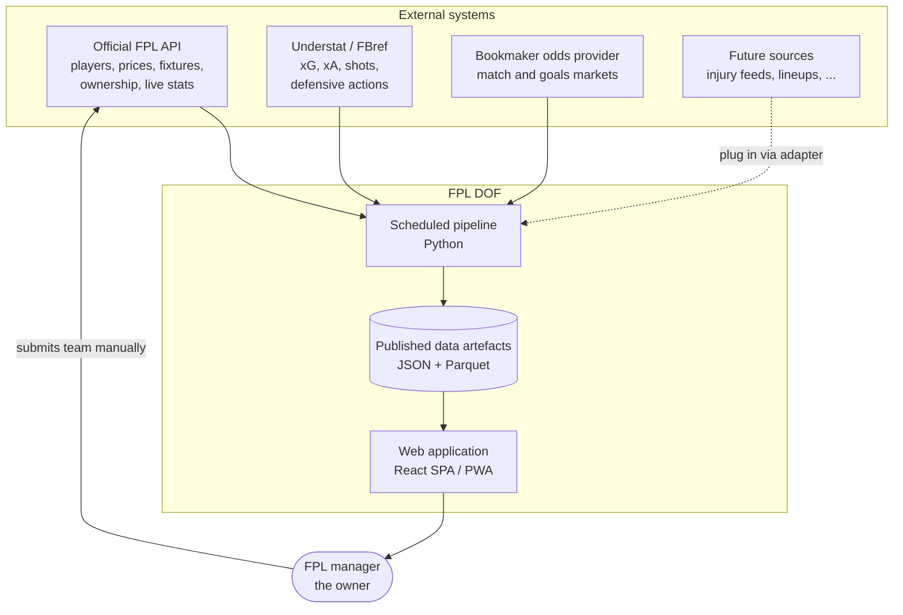
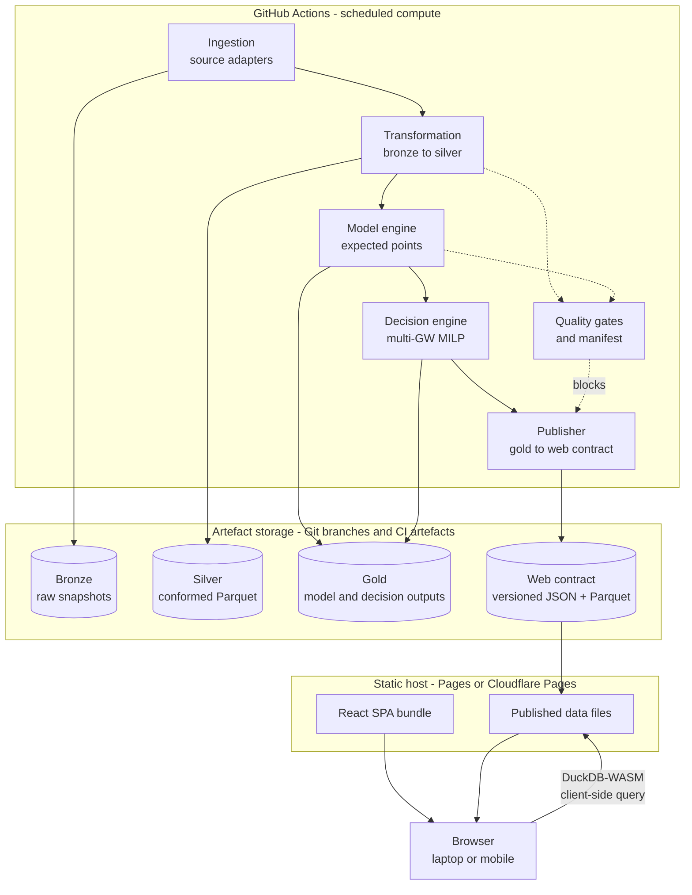
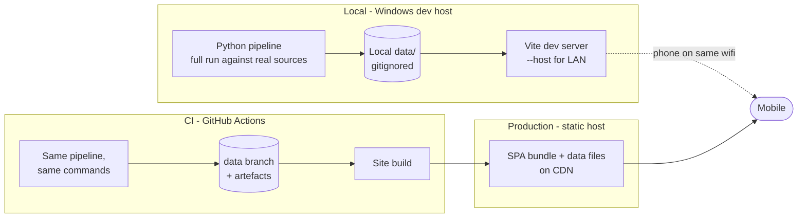

# Solution Architecture — FPL DOF

**Companion to:** [01-project-charter.md](01-project-charter.md), [02-project-plan-and-blueprint.md](02-project-plan-and-blueprint.md)
**Level:** High-level / logical-to-physical. Component internals are in [04-conceptual-design.md](04-conceptual-design.md).
**Baselined:** 2026-08-09

---

## 1. Architectural drivers

The architecture is shaped by four constraints and one ambition. Everything else follows.

| Driver | Source | Architectural consequence |
| --- | --- | --- |
| **Zero cost, no operated servers** | NFR-01, NFR-02, DL-03 | Batch-precompute architecture. No runtime backend, no database, no container to keep alive |
| **Hard weekly deadlines** | CON-1, OBJ-3 | Scheduling is a first-class concern with deadline-aware cadence and always-available manual override |
| **Undocumented, unversioned upstream APIs** | CON-5, CON-6 | Anti-corruption layer at every source boundary; immutable raw snapshots; contract tests |
| **Extensibility to new sources** | DL-05, FR-04 | Adapter plug-in framework with a registry; a conformed model that nothing upstream can leak into |
| **Multi-gameweek combinatorial optimisation** | DL-06 | Python analytics tier with a real MILP solver, run in CI where compute is free and unbounded by a request timeout |

### Architectural style

**Batch-precomputed, statically served, plugin-sourced.**

A scheduled pipeline pulls, conforms, models and optimises; it publishes immutable, versioned data
artefacts; a static single-page application reads those artefacts from a CDN. There is no request
path from the browser to any code the project operates.

This is deliberately old-fashioned and deliberately boring. It has no cold starts, no scaling
concerns, no availability risk beyond the CDN, no attack surface worth speaking of, and no bill.

---

## 2. Context view (C4 level 1)



Note the loop is **not closed**: the system never writes to FPL. The human is the actuator (ASM-6),
by design (DL-08, NFR-11).

---

## 3. Container view (C4 level 2)



### Container responsibilities

| Container | Technology | Responsibility | Never does |
| --- | --- | --- | --- |
| **Ingestion** | Python, httpx, adapter framework | Fetch from sources, rate-limit, retry, cache, snapshot raw bytes | Interpret or reshape data |
| **Transformation** | Python, pandas, DuckDB | Conform bronze into the canonical silver model; resolve entities | Know which source a field came from, beyond lineage metadata |
| **Model engine** | Python, scikit-learn / LightGBM, statsmodels | Produce expected points and variance per player per fixture | Make selection decisions |
| **Decision engine** | Python, PuLP + HiGHS | Solve for optimal squad, transfers, captaincy, chips | Predict anything |
| **Quality gates** | Python, Pandera | Assert schema, ranges, referential integrity, freshness; block publication | Repair data silently |
| **Publisher** | Python | Emit the versioned web data contract, prune, write the manifest | Contain business logic |
| **Web application** | React, TypeScript, Vite | Present, explore, explain; client-side what-if analysis | Fetch from any external API |
| **Artefact storage** | Git branch / CI artefacts | Durable, versioned, addressable storage | Serve queries |

---

## 4. The static-hosting constraint, and how interactivity survives it

DL-03 removes the server. Three tiers of interactivity replace it, and every UI feature is
consciously assigned to one.

| Tier | Mechanism | Latency | Used for |
| --- | --- | --- | --- |
| **T1 — Precomputed** | Pipeline computes it on a schedule; the app reads a file | Instant | Expected points, the recommended plan, chip calendar, fixture difficulty, scout tables, all charts |
| **T2 — Client-side compute** | Runs in the browser: DuckDB-WASM over published Parquet for querying; a JS/WASM solver for small re-optimisations | 50 ms – 3 s | Scout filtering and aggregation; "lock this player and re-pick my XI"; single-transfer what-ifs; formation and captain changes |
| **T3 — Job-triggered** | A `workflow_dispatch` CI run with parameters; results land as a new artefact | 2 – 10 min | Full multi-gameweek re-optimisation under bespoke constraints; wildcard drafting; backtests |

**Design rule:** anything the owner will want *at the deadline, under time pressure* must be T1 or T2.
T3 is for exploration, never for the critical path. This rule is what keeps the zero-cost choice from
degrading the product.

---

## 5. Technology decisions

### 5.1 Analytics tier — Python

| Concern | Choice | Rationale | Rejected |
| --- | --- | --- | --- |
| Language | Python 3.12+ | Mandated by DL-04; the only ecosystem with mature ML *and* MILP tooling | — |
| Packaging / env | `uv` (or `pip` + venv fallback) | `uv` is fast and lockfile-based; not currently installed, so `pip-tools` is the fallback | Poetry, conda — heavier for a solo project |
| HTTP | `httpx` | Sync and async, timeouts, transport hooks for rate limiting | `requests` — no async path if ingestion needs parallelism |
| Dataframes | `pandas` + `DuckDB` | pandas for modelling ergonomics; DuckDB for SQL over Parquet, and it is the same engine the browser will run | Polars — excellent, but DuckDB's WASM story is the deciding factor |
| Storage format | Parquet (silver, gold), JSON (web contract, bronze) | Columnar, compressed, partitionable, natively readable by DuckDB-WASM | CSV — no types, no compression; SQLite — worse in the browser for analytics |
| ML | scikit-learn, LightGBM, statsmodels | Tabular problems; gradient boosting is the right default; statsmodels for Poisson/Dixon-Coles goal models | Deep learning — nothing here justifies it |
| Optimisation | **PuLP with HiGHS** | Open-source, no licence, strong MIP performance, readable model definition | OR-Tools CP-SAT (viable alternative, less natural for a linear budget model); CBC (slower); Gurobi/CPLEX (licence cost) |
| Validation | Pandera | Declarative dataframe schemas that double as documentation | Great Expectations — too heavy for this scale |
| Logging | `structlog` | Structured JSON logs that survive CI and feed the manifest | stdlib logging alone — unstructured |
| Testing | pytest, Hypothesis, `respx`/`vcrpy` | Property tests for optimiser legality; recorded responses for adapter contracts | — |

### 5.2 Web tier — TypeScript

| Concern | Choice | Rationale | Rejected |
| --- | --- | --- | --- |
| Framework | React 19 + TypeScript, strict mode | Mandated by DL-04; largest component ecosystem for data-dense UI | Svelte, Vue — fine, smaller ecosystem for tables and charts |
| Build | Vite | Fast, static output, trivial to deploy, first-class PWA plugin | Next.js — its value is SSR and API routes, both excluded by DL-03 |
| Routing | React Router, hash or history with SPA fallback | Static hosts need a fallback rewrite for deep links — must be configured | — |
| Data fetching | TanStack Query over `fetch` | Caching, stale-while-revalidate, retry against static files | — |
| Tables | TanStack Table + virtualisation | ~700 players × many columns; virtualisation is required for NFR-04 | Ready-made grids — heavier, less controllable |
| Charts | Recharts, or visx where custom marks are needed | Trend lines, distributions, comparison charts | D3 direct — more control, more time |
| Styling | Tailwind CSS with CSS custom properties for theming | Fast, consistent, light/dark via tokens | CSS-in-JS — runtime cost |
| Client analytics | **DuckDB-WASM** | Runs SQL over the published Parquet in the browser: T2 interactivity without a server | Shipping pre-aggregated JSON for every filter combination — combinatorially impossible |
| Client solver | `highs-js` (WASM) or a greedy heuristic | Small T2 re-optimisations only | Reimplementing the MILP in TS — no |
| PWA | `vite-plugin-pwa` | Offline access to last-published data (FR-34) | — |
| Testing | Vitest, React Testing Library, Playwright | Unit, component and a deployed-site smoke test | — |

### 5.3 Platform

| Concern | Choice | Rationale |
| --- | --- | --- |
| Orchestration | GitHub Actions | Free, already integrated with the repo, cron and manual dispatch built in, secret storage included |
| Artefact storage | A dedicated `data` branch (or a sibling repo) plus CI artefacts | Free, versioned, diffable, no external service. Keeps the main branch history clean of large binaries |
| Hosting | GitHub Pages, or Cloudflare Pages (OD-02) | Both free. Pages is simpler; Cloudflare has a better CDN and higher limits |
| Secrets | GitHub Actions encrypted secrets | Never in the repo, never in the client bundle (NFR-13) |
| Alerting | Actions failure notification, plus auto-created issues | Free, no third party |

**Repository visibility (OD-01) is architecturally significant.** A public repository gets unlimited
Actions minutes and free Pages. A private repository on the Free plan gets 2,000 minutes/month and
cannot use Pages without a paid plan. The architecture assumes a **public repository with no secrets
committed**; if privacy is required, Cloudflare Pages plus a minutes budget becomes mandatory.

---

## 6. Data flow

```mermaid
sequenceDiagram
    autonumber
    participant CRON as Schedule / dispatch
    participant ING as Ingestion
    participant SRC as Sources
    participant BRZ as Bronze
    participant TRF as Transform
    participant SLV as Silver
    participant QG as Quality gates
    participant MOD as Model engine
    participant OPT as Decision engine
    participant PUB as Publisher
    participant CDN as Static host

    CRON->>ING: trigger run, run_id assigned
    ING->>SRC: fetch, rate-limited, cached, retried
    SRC-->>ING: raw responses
    ING->>BRZ: write immutable snapshot + lineage
    ING->>TRF: hand off run_id
    TRF->>BRZ: read snapshots
    TRF->>SLV: conform, resolve entities, write Parquet
    TRF->>QG: assert schema, ranges, refs, freshness
    alt gate fails
        QG-->>CRON: block, alert, keep last good published
    else gate passes
        MOD->>SLV: read features
        MOD->>MOD: minutes, team strength, components
        MOD->>OPT: expected points + variance
        OPT->>OPT: solve multi-GW MILP with chips and risk
        OPT->>PUB: squad, transfers, chip plan, explanations
        PUB->>CDN: versioned web contract + manifest
    end
```

**Key property:** a failed gate never publishes. The site continues serving the last good artefact
set, visibly stale on the data health page, rather than serving something wrong. Stale and honest
beats fresh and broken when the output drives real decisions.

---

## 7. Data architecture

### 7.1 Medallion layers

| Layer | Content | Format | Retention | Mutability |
| --- | --- | --- | --- | --- |
| **Bronze** | Verbatim source responses, one file per source per endpoint per run | Gzipped JSON/HTML | Rolling window in full, plus one permanent snapshot per gameweek | Immutable |
| **Silver** | Conformed canonical entities, deduplicated, cross-source keys resolved | Parquet, partitioned by season and gameweek | Full history | Rebuildable from bronze |
| **Gold** | Model outputs, optimiser results, metrics, explanations | Parquet + JSON | Full history — this is the evidence trail for what was advised, when | Append-only |
| **Web contract** | The narrow, versioned slice the front end is allowed to read | JSON + Parquet, hashed filenames | Current plus a small rolling window | Replaced per publish |

### 7.2 The web data contract

The single most important interface in the system: the boundary between DL-04's two languages.

- **Versioned.** `/data/v1/...`. A breaking change bumps to `v2` and both are published during the
  transition, so a stale cached client never breaks.
- **Typed on both sides.** Python Pandera schemas and TypeScript types generated from one shared JSON
  Schema definition. Drift between the two is a build failure, not a runtime surprise.
- **Split by access pattern:**
  - `bootstrap.json` — small, always loaded: teams, gameweeks, metadata, manifest pointer
  - `players.parquet` — the scout dataset, queried in-browser with DuckDB-WASM
  - `player/{id}.json` — per-player detail and history, lazy-loaded
  - `xp.parquet` — expected points per player per upcoming gameweek, with decomposition and variance
  - `recommendation.json` — the current squad, plan, chip calendar and explanations
  - `fixtures.json`, `metrics.json`, `manifest.json`
- **Budgeted.** Initial load ≤ 3 MB (NFR-04); everything else lazy.

### 7.3 Storage volume

Roughly 700 players × 38 gameweeks × ~60 columns per season is under 2 million cells — a few MB of
Parquet per season. Bronze snapshots dominate: full JSON several times daily, gzipped, in the low
hundreds of MB per season if retained naively. Hence the retention policy in 7.1 and phase 5.7:
**full snapshots in a rolling window, one permanent snapshot per gameweek.** Volume is not a
technical problem here, but unbounded growth in a Git branch would eventually become one.

---

## 8. Deployment and environments



| Environment | Purpose | Data | Access |
| --- | --- | --- | --- |
| **Local** | Development, debugging, ad-hoc analysis | Real sources, local cache; can also replay bronze snapshots offline | `localhost`, plus LAN for mobile testing via `vite --host` (NFR-03) |
| **CI** | The only path to production | Real sources, artefacts to the data branch | GitHub |
| **Production** | The live app | Published web contract only | Public URL, laptop and mobile |

**Local/CI parity (NFR-09)** is enforced structurally: CI invokes exactly the same entry points a
developer does, with no CI-only branches in the code. The only differences are credentials and
schedule.

---

## 9. Orchestration topology

Five workflows. Cadence escalates as a deadline approaches, and every one is manually dispatchable.

| Workflow | Trigger | Does |
| --- | --- | --- |
| `ci.yml` | Push, pull request | Lint, type-check, unit and property tests, contract tests |
| `ingest-fast.yml` | Every 4h; hourly within 24h of a deadline; dispatch | FPL API only — prices, status, ownership. Cheap and frequent |
| `ingest-slow.yml` | Daily; odds on a credit budget; dispatch | Understat, FBref, odds. Expensive and rate-limited |
| `pipeline.yml` | After ingest; nightly; T−3h and T−45m before each deadline; dispatch | Transform → gates → model → optimise → publish |
| `deploy.yml` | On publish; on push to main; dispatch | Build the SPA, deploy site and data |
| `backtest.yml` | Weekly; dispatch | Walk-forward regression; writes model metrics |

**Scheduling caveat (R-09):** scheduled CI runs are best-effort and can be delayed under platform
load. Nothing is scheduled close to a deadline — the last automatic run is T−45m, and manual dispatch
is always the fallback. A missed cron must never be the reason a deadline is missed.

---

## 10. Cross-cutting concerns

### 10.1 Configuration

Layered, most specific wins: repository defaults (YAML, committed) → environment variables →
local override file (gitignored) → CLI arguments. Sensitive values only ever arrive by environment
variable, sourced from Actions secrets. Every run records its **effective resolved configuration** in
the manifest, so any published output can be tied to the exact settings that produced it.

### 10.2 Observability

No paid observability tooling exists in a £0 budget, so observability is built from artefacts:

- **Structured JSON logs** per run, retained as CI artefacts.
- **Run manifest** — `run_id`, git SHA, start/end, per-source response codes and byte counts, row
  counts per table, gate results, model versions, solver status and objective value, output checksums.
- **Metrics history** — a `metrics.parquet` appended every run: freshness, volumes, model accuracy,
  solve times.
- **Data health page** (FR-33) — the app renders the manifest and metrics history directly. The
  monitoring dashboard *is* the product, which is the only way this stays free and maintained.

### 10.3 Failure handling

| Failure | Behaviour |
| --- | --- |
| A source is unavailable | Retry with backoff; fall back to the cached snapshot; mark the source degraded in the manifest |
| A non-FPL source fails entirely | Pipeline continues with reduced features; the app shows a degraded-source banner (NFR-15) |
| The FPL API fails | Pipeline aborts; last good publication stays live; alert raised |
| A quality gate fails | Publication blocked; last good publication stays live; alert raised |
| The solver fails or times out | Fall back to the greedy heuristic; flag the recommendation as fallback-quality |
| A deploy fails | Previous site remains live; static hosting makes this the default |

### 10.4 Security and privacy

- No authentication anywhere; no user data; no FPL credentials (NFR-11, DL-08).
- Secrets only in Actions; secret scanning in CI; the client bundle is inspected for leaked keys.
- Dependencies pinned by lockfile, with automated update pull requests reviewed before merge.
- Published artefacts are public data derived from public sources.
- Threat model is genuinely small: a static site with no inputs, no session and no secrets. The main
  realistic risk is supply-chain compromise of a dependency, hence pinning and review.

### 10.5 Legal and ethical use (NFR-10)

| Source | Access | Obligations |
| --- | --- | --- |
| FPL API | Public JSON, unauthenticated | Honest user agent, conservative rate limiting, cache aggressively, no scraping of authenticated endpoints |
| Understat / FBref | Scraped HTML | Respect `robots.txt`, enforce a crawl delay, cache hard, personal non-commercial use only, attribute in the UI |
| Odds provider | Documented API | Stay inside the free-tier terms and credit cap |

Attribution appears in the app footer. The system is personal and non-commercial; nothing is
redistributed as a product.

---

## 11. Repository structure

```
fpl_dof2/
├─ docs/                          # this documentation set
├─ .github/workflows/             # the five orchestration workflows
│
├─ pipeline/                      # Python: everything before the web contract
│  ├─ src/fpl_dof/
│  │  ├─ config/                  # layered config, season and rule parameters
│  │  ├─ sources/                 # ADAPTERS - the only code that knows a source exists
│  │  │  ├─ base.py               #   interface + rate limit, retry, cache, snapshot
│  │  │  ├─ registry.py           #   plug-in registration
│  │  │  ├─ fpl.py  understat.py  fbref.py  odds.py
│  │  ├─ ingest/                  # run orchestration for ingestion
│  │  ├─ transform/               # bronze -> silver, canonical model
│  │  ├─ entity/                  # cross-source ID crosswalk + manual overrides
│  │  ├─ features/                # feature engineering
│  │  ├─ rules/                   # FPL scoring, price, transfer, chip mechanics (pure)
│  │  ├─ models/                  # minutes, team strength, components, xP aggregation
│  │  ├─ optimise/                # MILP build, chips, risk, explanations, fallback
│  │  ├─ backtest/                # walk-forward harness and reporting
│  │  ├─ quality/                 # Pandera schemas and gates
│  │  ├─ publish/                 # gold -> versioned web contract
│  │  └─ obs/                     # logging, manifest, metrics, lineage
│  └─ tests/                      # unit, property, contract, golden-file
│
├─ web/                           # TypeScript: everything after the web contract
│  ├─ src/{routes,components,charts,data,state,types}
│  └─ tests/
│
├─ contracts/                     # shared JSON Schema -> Pandera + TS types
├─ data/                          # local working data (gitignored)
└─ README.md
```

Two things are load-bearing in this layout:

1. **`sources/` is the only directory that may import a source-specific concept.** Enforced by an
   import-linting rule in CI, not by good intentions. This is what makes FR-04 real.
2. **`contracts/` is the single definition of the two-language boundary.** Both sides generate from
   it; neither hand-writes it.

---

## 12. Non-functional architecture

| Quality | How the architecture delivers it |
| --- | --- |
| **Cost** | No compute outside free CI; no database; no paid tier. The bill is structurally zero, not carefully managed to zero |
| **Availability** | CDN-served static files. Pipeline downtime degrades freshness, never availability |
| **Performance** | Precomputation moves all heavy work off the request path; virtualised tables and DuckDB-WASM keep interaction local; lazy-loaded detail keeps first load small |
| **Scalability** | Not a requirement — one user, ~700 players. The design is bounded by CI wall-clock, addressed by candidate pruning |
| **Reproducibility** | Immutable bronze + pinned dependencies + recorded config + git SHA in every manifest ⇒ any output is regenerable (NFR-06) |
| **Evolvability** | Adapter plug-ins for sources; a typed contract between prediction and optimisation for models; a versioned web contract for the UI. The three axes most likely to change are the three that are abstracted |
| **Testability** | Rules and constraints are pure functions; adapters are contract-tested against recordings; optimiser output is property-tested for legality |
| **Operability** | One maintainer, so the manifest and data health page carry the operational load |

### Known limitations, accepted

| Limitation | Why accepted |
| --- | --- |
| No live in-play data | Out of scope; batch cadence cannot support it |
| Full re-optimisation is minutes, not seconds (T3) | Deadline-critical paths are all T1/T2; acceptable for exploration |
| Pre-deadline squad state needs reconstruction or manual entry | Consequence of DL-08's no-credentials stance; correct trade |
| Scraped sources will break periodically | Contract tests detect it; NFR-15 contains the blast radius |
| Single region, single host | One user; the CDN handles it |

### Evolution paths, pre-considered

| If this becomes necessary | Change required |
| --- | --- |
| Stochastic / Monte-Carlo optimisation | Swap the model→optimiser contract implementation. Optimiser interface already carries variance (DL-06) |
| A new data source | One adapter module plus a config entry (FR-04) |
| Real-time or on-demand API | Add a serverless endpoint reading the same gold layer. Nothing else changes — the data layer is already the source of truth |
| Multi-user | Requires auth and per-user state; this architecture would need a backend tier. Consciously deferred (charter §4.3) |
| Heavier compute than CI allows | Run the pipeline locally or on a home machine and publish the same artefacts. The contract is the boundary, so the app never knows |
