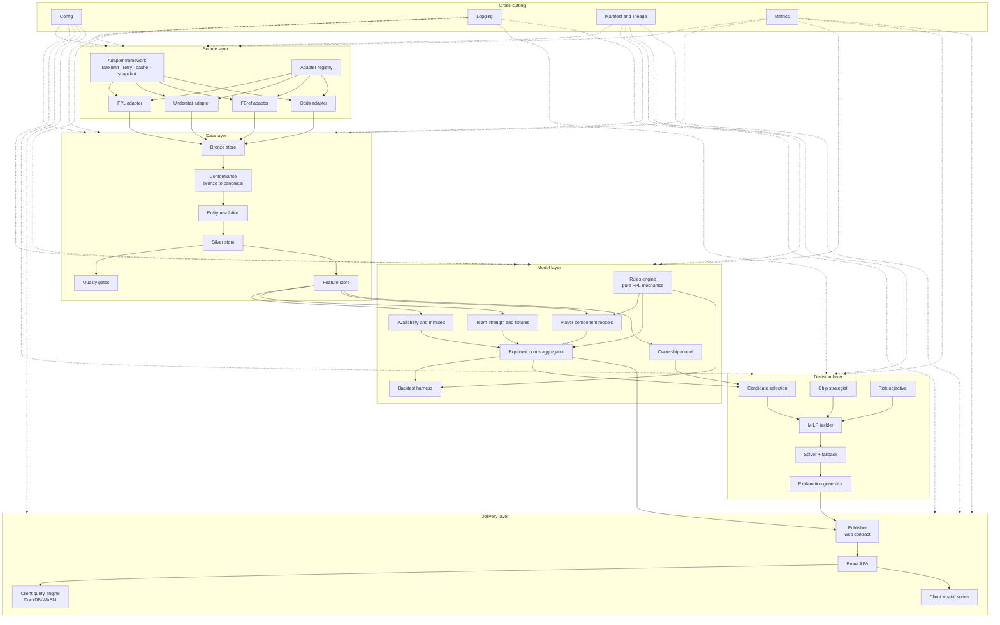
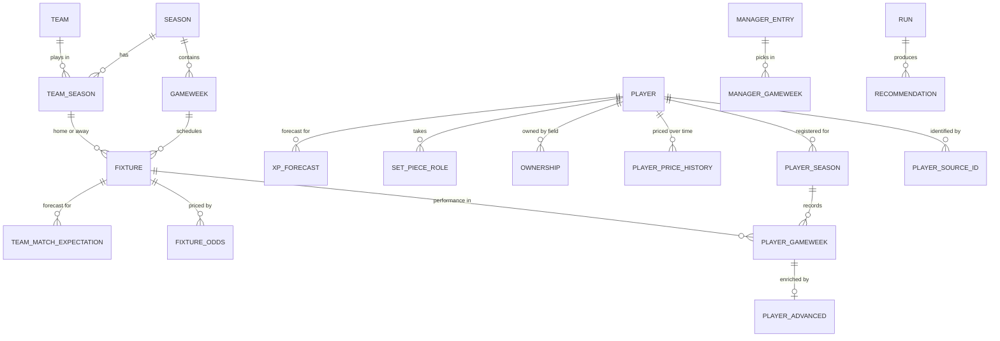
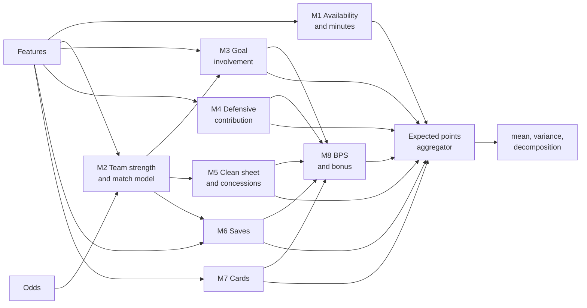
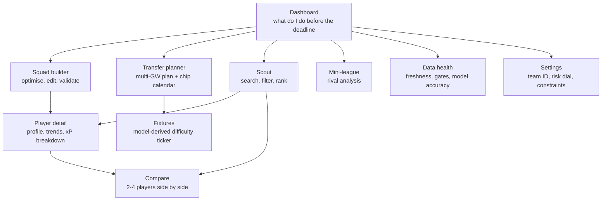

# Conceptual Design — FPL DOF

**Companion to:** [03-solution-architecture.md](03-solution-architecture.md)
**Level:** Logical component design. What each component is, what it consumes and produces, and how
it works. Implementation detail (function signatures, exact libraries in use) belongs in code.
**Baselined:** 2026-08-09

---

## Contents

1. [Logical component map](#1-logical-component-map)
2. [Data sources](#2-data-sources)
3. [Data layer](#3-data-layer)
4. [Application and domain services](#4-application-and-domain-services)
5. [Analytical models](#5-analytical-models)
6. [Decision engine](#6-decision-engine)
7. [Risk and ownership model](#7-risk-and-ownership-model)
8. [User experience](#8-user-experience)
9. [Orchestration](#9-orchestration)
10. [Testing](#10-testing)
11. [Documentation](#11-documentation)
12. [Logging, metrics, metadata and lineage](#12-logging-metrics-metadata-and-lineage)
13. [Configuration and feature flags](#13-configuration-and-feature-flags)
14. [Extensibility](#14-extensibility)
15. [Open design questions](#15-open-design-questions)

---

## 1. Logical component map



**Dependency rule, enforced by import linting in CI:** dependencies point downward and rightward only.
The model layer may not import from the source layer. The decision layer may not import models — only
their typed outputs. Nothing outside `sources/` may name a source.

---

## 2. Data sources

### 2.1 Source catalogue

#### S1 — Official FPL API *(critical, no fallback)*

Public, unauthenticated JSON. Undocumented and unversioned (CON-5). The spine of the system: it alone
provides prices, ownership, official status flags and the authoritative points ledger.

| Endpoint | Provides | Cadence |
| --- | --- | --- |
| `bootstrap-static/` | All players with prices, ownership, form, status, chance-of-playing, totals; teams with strength ratings; positions; gameweek events; game settings | Every 4h; hourly near a deadline |
| `fixtures/` | Full fixture list, kickoff times, FPL difficulty ratings, per-match stats once played | Every 4h |
| `element-summary/{id}/` | Per-player gameweek history, prior-season history, upcoming fixtures | Daily; on demand for detail views |
| `event/{gw}/live/` | Per-player stats and points for a gameweek, including BPS | Hourly during and just after a gameweek |
| `entry/{team_id}/` · `/history/` · `/event/{gw}/picks/` · `/transfers/` | The owner's team: value, bank, chips used, past picks and transfers | Post-deadline and post-gameweek |
| `leagues-classic/{id}/standings/` | Mini-league standings for rival analysis (FR-32) | Weekly |
| `set-piece-notes/` | Penalty, free-kick and corner responsibilities | Weekly |

**Known gap (CON-10, I-02):** `picks` for the *current* gameweek is only public after the deadline
has passed. Before a deadline the current squad must be **reconstructed** — last finished gameweek's
picks, plus the public transfers feed, plus price-change history for bank and value — with a manual
paste-in override for when reconstruction is ambiguous.

**Handling:** honest user agent, conservative rate limit, ETag/conditional requests where supported,
and every response snapshotted to bronze before anything reads it.

#### S2 — Understat *(enhancing, degradable)*

Shot-level expected goals for the Premier League. Player-level xG, npxG, xA, shots and key passes;
match-level shot data with situation and shot type. Data is embedded in page scripts rather than
served as an API, so extraction is brittle by nature (R-06). Weekly cadence, cached hard, contract
test against a recorded page.

**Why it matters:** underlying numbers are far more predictive of future returns than actual goals,
especially in the first ten gameweeks when goal counts are pure noise.

#### S3 — FBref *(enhancing, degradable)*

Broad Opta-derived statistics: progressive passes and carries, shot- and goal-creating actions,
touches in the penalty area, tackles, interceptions, blocks, clearances, recoveries, aerials.

**Why it matters:** the only viable source for modelling **Defensive Contribution points**, which
since 25/26 are a large and unusually predictable chunk of defender and midfielder scoring. Rate-based
defensive volume is far more stable week to week than goal involvement — which makes it the highest
signal-to-noise component in the whole expected-points model.

**Handling:** strict crawl delay, `robots.txt` respected, aggressive caching, weekly cadence at most,
personal non-commercial use, attributed in the UI (NFR-10). A wrapper library that already handles
polite access is preferred over bespoke scraping.

#### S4 — Bookmaker odds *(enhancing, degradable, credit-capped)*

Match result and total-goals markets, converted into team-level goal expectations.

**Why it matters:** betting markets aggregate more information than any model this project will
build — injuries, lineups, motivation, weather. For *team-level* scoring over a 1–2 gameweek horizon
they are the single strongest available signal. The model should defer to them and use its own
ratings to fill the longer horizon where odds do not yet exist.

**Handling:** free-tier credit budget tracked in the adapter and enforced as a hard cap (CON-7, R-08).
Fetch on a fixed weekly schedule plus one pre-deadline refresh; cache everything; degrade cleanly to
the xG-based team-strength model when credits are exhausted.

#### S5 — Historical archive *(build-time, important)*

Prior-season per-gameweek player data for model training and backtesting (FR-06, D-06). Sourced from
the FPL API's own historical endpoints where available, supplemented by an established community
archive of per-gameweek CSVs. Ingested once, snapshotted, then treated as static.

#### Future sources *(OD-04)*

Injury and press-conference feeds, predicted lineups, player-level prop odds, weather. None are in
scope now; all are anticipated by the adapter framework and require no design change to admit.

### 2.2 Adapter framework

The mechanism that makes DL-05 and FR-04 real. Every adapter implements one interface, and the base
class supplies all cross-cutting behaviour so an adapter author writes only source-specific logic.

**Interface contract:**

| Member | Responsibility |
| --- | --- |
| `name`, `version` | Identity, recorded in lineage |
| `cadence` | Declared refresh policy the scheduler reads |
| `declares()` | Which canonical entities this source can populate, and at what granularity |
| `fetch(context)` | Return raw payloads plus request metadata. **No parsing** |
| `parse(raw)` | Raw → source-shaped records. **No conformance, no business logic** |
| `to_canonical(records)` | Source-shaped → canonical model, emitting source-native IDs for the crosswalk |
| `health()` | Self-check used by the quality gate and the data health page |

**Supplied by the base class**, never reimplemented per adapter: rate limiting, retry with
exponential backoff and jitter, response caching, bronze snapshotting with checksums, honest user
agent, `robots.txt` compliance, credit budgeting, structured logging, error taxonomy, and lineage
emission.

**Registry:** adapters self-register; configuration enables, disables and prioritises them. A
disabled or failing source removes its contributed fields and nothing else (NFR-15).

**Conflict resolution:** where two sources supply the same canonical field, configuration declares
precedence per field — for example, minutes and prices always come from FPL, xG prefers Understat and
falls back to FBref. Precedence is data, not code.

---

## 3. Data layer

### 3.1 Canonical entity model



| Entity | Purpose | Notable fields |
| --- | --- | --- |
| `player` | Canonical identity across sources and seasons | canonical id, display name, normalised name key, date of birth where available |
| `player_source_id` | The crosswalk | canonical id, source, source id, match method, confidence, verified flag |
| `player_season` | Season registration | club, position, initial price, shirt number |
| `player_gameweek` | The performance ledger | minutes, goals, assists, clean sheet, goals conceded, saves, penalties saved/missed, cards, own goals, defensive-action counts, BPS, bonus, total points, opponent, home/away |
| `player_advanced` | Enrichment from S2/S3 | xG, npxG, xA, shots, shots on target, key passes, SCA/GCA, box touches, tackles, interceptions, blocks, clearances, recoveries |
| `player_price_history` | Price and transfer flow | date, price, net transfers, ownership percentage |
| `fixture` | Match | teams, kickoff, status, scores, FPL difficulty, gameweek |
| `fixture_odds` | Market view | bookmaker, market, captured-at, prices, derived goal expectations |
| `team_match_expectation` | Model view | expected goals for/against, clean-sheet probability, concession distribution |
| `ownership` | The field's behaviour | selected-by percentage, captaincy percentage, effective ownership |
| `set_piece_role` | Penalties, free kicks, corners | role, confidence, as-at date |
| `manager_entry` / `manager_gameweek` | The owner's team over time | squad, captain, bank, value, free transfers, chips used, points, rank |
| `xp_forecast` | Model output | expected points mean and variance, per-component decomposition, minutes probabilities, model version, run id |
| `recommendation` | Decision output | squad, XI, captain, transfers, chip, objective value, explanation, run id |

**Design notes.** Everything is keyed on the canonical player id, never a source id. `player_gameweek`
is one row per player *per fixture*, not per gameweek, so double gameweeks and postponements are
natural rather than special cases — a small decision that removes a whole class of bug. Every table
carries `run_id` and `source_version` for lineage.

### 3.2 Entity resolution (FR-07, R-10)

The highest-risk silent-failure mode in the system. A mismatched player quietly attributes one
footballer's expected goals to another, and nothing visibly breaks.

**Approach — deterministic first, fuzzy second, human third:**

1. **Deterministic** — exact normalised name plus club plus position. Normalisation strips accents,
   punctuation and common suffixes, and handles the "known as" problem where sources disagree between
   full legal names and playing names.
2. **Fuzzy** — token-set similarity on names, constrained by club and position, with a confidence
   score. Only accepted above a high threshold *and* when unambiguous within the club.
3. **Manual override** — a committed, reviewed `player_crosswalk_overrides.yaml`. The escape hatch,
   and deliberately in version control so every manual decision is auditable.
4. **Unresolved report** — everything else is listed on the data health page rather than silently
   dropped.

**Guardrails:** unmatched rate above a configured threshold fails the quality gate; a canonical id
mapping to two ids from the same source fails immediately; new-season resolution is re-run from
scratch because transfers invalidate club-based matching.

### 3.3 Layers and physical layout

| Layer | Layout | Notes |
| --- | --- | --- |
| Bronze | `bronze/{source}/{endpoint}/{date}/{run_id}.json.gz` | Immutable, checksummed, with a sidecar of request metadata |
| Silver | `silver/{entity}/season={s}/gw={g}/part.parquet` | Hive-partitioned, fully rebuildable from bronze |
| Gold | `gold/{artefact}/season={s}/gw={g}/part.parquet` | Append-only. The record of what was advised and when |
| Web contract | `web/v1/*.json` and `*.parquet` | Versioned, hashed, size-budgeted (architecture §7.2) |

### 3.4 Quality gates (FR-08)

Declarative schemas, executed as a blocking stage. Four classes of assertion:

| Class | Examples |
| --- | --- |
| **Schema** | Column presence, dtype, nullability, categorical domains for positions and statuses |
| **Range** | Minutes 0–120, prices 3.5–16.0, percentages 0–100, non-negative counts, points within plausible bounds |
| **Referential** | Every `player_gameweek` resolves to a player and a fixture; every fixture resolves to two distinct teams; no orphan crosswalk entries |
| **Freshness and volume** | Data no older than the configured threshold; row counts within a tolerance band of the previous run — a 40% drop in players means something upstream broke, not that 40% of footballers retired |

**Severity model:** `error` blocks publication; `warn` publishes but surfaces on the data health page;
`info` is recorded only. Every gate names the requirement it protects.

### 3.5 Feature store

Not a product, just a curated, cached, tested set of derived features shared by every model and by the
backtester — which is the point, because it guarantees training and inference see identical
definitions.

Feature families: rolling windows over 3/6/10 appearances; per-90 rates with minutes-weighted
shrinkage; opponent-adjusted metrics; home/away splits; rest days and fixture congestion; role
indicators from set-piece data and starting frequency; team-context features; price and ownership
momentum; a positional-and-price prior tier for cold-start players.

**Hard rule:** every feature is stamped with the gameweek at which it becomes knowable. The backtester
enforces this, and it is the single defence against look-ahead leakage (R-04).

---

## 4. Application and domain services

Between data and delivery sit stateless domain services — pure, exhaustively testable, and where
almost all FPL-specific correctness lives.

### 4.1 Rules engine

The authoritative implementation of FPL mechanics for 2026/27. Every parameter is configuration, not
a literal, so a mid-season rule change is a config edit (ASM-4). Values are seeded from the API's
own game settings where exposed, and otherwise from the published rules.

**Scoring — 2026/27**

| Event | GK | DEF | MID | FWD |
| --- | --- | --- | --- | --- |
| Playing 1–59 minutes | 1 | 1 | 1 | 1 |
| Playing 60+ minutes | 2 | 2 | 2 | 2 |
| Goal scored | 6 | 6 | 5 | 4 |
| Assist | 3 | 3 | 3 | 3 |
| Clean sheet (60+ min) | 4 | 4 | 1 | 0 |
| Every 3 saves | 1 | — | — | — |
| Penalty save | 5 | — | — | — |
| Penalty miss | −2 | −2 | −2 | −2 |
| Every 2 goals conceded | −1 | −1 | — | — |
| Yellow card | −1 | −1 | −1 | −1 |
| Red card | −3 | −3 | −3 | −3 |
| Own goal | −2 | −2 | −2 | −2 |
| Defensive Contribution | — | 2 at 10+ CBIT | 2 at 12+ CBIRT | 2 at 12+ CBIRT |
| Bonus | 3 / 2 / 1 to the top three BPS in each match | | | |

CBIT = clearances, blocks, interceptions, tackles. CBIRT additionally counts ball recoveries.

**Bonus Points System — revised for 2026/27**, to reduce overlap with Defensive Contribution:

- The penalty for being tackled is removed, which benefits dribble-heavy attackers.
- Clearances, blocks and interceptions now score 1 BPS per **3** actions, down from 1 per 2.
- Goalkeeper saves are restructured: saves from outside the box no longer score; other saves score;
  saving a big chance scores additionally.

> The full BPS matrix is long and was materially revised this season. It is **parameterised in
> configuration and verified against the official rules at implementation time**, not hardcoded from
> this document. The conformance test in §10 is what proves the implementation correct.

**Squad and selection rules**

| Rule | Value |
| --- | --- |
| Squad size | 15 — exactly 2 GK, 5 DEF, 5 MID, 3 FWD |
| Initial budget | £100.0m |
| Players per club | Maximum 3 |
| Starting XI | 11, with exactly 1 GK, 3–5 DEF, 2–5 MID, 1–3 FWD |
| Captain / vice | Captain scores double; vice substitutes if the captain does not play |
| Bench | Ordered 1–3 for outfield players; the substitute goalkeeper is automatic |

**Transfers, price and chips**

| Rule | Value |
| --- | --- |
| Free transfers | 1 per gameweek, accumulating to a maximum of **5** |
| Extra transfers | −4 points each |
| Price movement | ±£0.1 driven by net transfers; evaluated daily at midnight UK time |
| Selling price | Purchase price plus 50% of any profit, rounded down to £0.1 — the sell-on fee |
| Chips | Two sets of four: Wildcard, Free Hit, Triple Captain, Bench Boost. One chip per gameweek |
| Chip set 1 expiry | **GW19 deadline, 13:30 GMT, 2 January 2027** — unused chips are lost |
| AFCON allowance | None this season |

### 4.2 Squad state service

Reconstructs and maintains the owner's true position: current 15, purchase prices and therefore
selling values, bank, free transfers available, chips used and remaining. Handles the pre-deadline
visibility gap (CON-10) by rebuilding from the last public picks plus the transfers feed, flagging
its own confidence, and accepting a manual override when it cannot be certain. Free-transfer count is
recomputed from transfer history rather than assumed, because it is easy to get wrong and expensive
to get wrong.

### 4.3 Fixture and schedule service

Derives what the raw fixture list implies: gameweek fixture counts per team, double and blank
gameweeks, congestion windows, rest days, and a **model-derived difficulty rating** that replaces
FPL's static one with the actual forecast goal expectations (FR-30). Handles postponements and
rescheduling, which reshape the entire chip strategy in the second half of the season.

### 4.4 Explanation service

Turns optimiser output into something a human will act on (B6, FR-23). For each recommendation:
the expected-points decomposition by component, the marginal gain over doing nothing, the runner-up
options and why they lost, the ownership bet implied, the price-change exposure, and the key
assumptions — for example, "this assumes he starts, which the model puts at 71%."

---

## 5. Analytical models

The core intellectual work. Structured as a **chain of small, individually testable models**, not one
monolithic regression, for three reasons: each component is validated against its own observable
outcome; failures are diagnosable; and the decomposition is exactly what the explanation layer needs.



### M1 — Availability and minutes

**Predicts:** a distribution over `{0, 1–59, 60+}` minutes, plus expected minutes.
**Why it dominates:** a player who does not play scores nothing. Minutes uncertainty is the largest
single source of expected-points error, and getting it roughly right matters more than getting
anything else exactly right.
**Inputs:** FPL status flag and chance-of-playing percentage, recent minutes pattern, start frequency,
substitution patterns, rotation behaviour by manager, fixture congestion, price tier as a proxy for
importance, and time since injury return.
**Method:** ordinal or multinomial classification over the three bands, calibrated so the
probabilities are usable directly rather than merely ranked correctly.
**Validated on:** realised minutes bands, with calibration curves and Brier score.

### M2 — Team strength and match model

**Predicts:** expected goals scored and conceded for each team in each fixture.
**Method:** a blend of two views —
- **Market view:** bookmaker match and totals markets, de-vigged and converted into implied goal
  expectations for each side. Highly accurate but only available for near-term fixtures.
- **Model view:** a Poisson-style bivariate goals model with time-decayed attack and defence ratings
  estimated from xG rather than goals, plus home advantage. Available for the full horizon.

The blend weight is a function of horizon: near gameweeks defer to the market, distant gameweeks to
the ratings. Promoted teams and heavily rebuilt squads get widened priors, which matters
disproportionately in August.
**Validated on:** realised goals and clean sheets; calibration of clean-sheet probability.

### M3 — Goal involvement

**Predicts:** expected goals and expected assists per player per fixture.
**Method:** allocate the team's expected goals (from M2) across its players using shares — npxG per 90,
xA per 90, shot volume and quality, box touches, position and role — then apply penalty and set-piece
duty explicitly, because penalties are a large, lumpy, highly identifiable source of points. Rates
are shrunk toward positional and price-tier priors in inverse proportion to minutes played, which is
what makes the model behave sensibly in the first six gameweeks instead of chasing noise.
**Validated on:** realised goals and assists; rank correlation within position.

### M4 — Defensive contribution

**Predicts:** the probability of hitting the CBIT/CBIRT threshold, given the minutes distribution.
**Method:** a count model of defensive actions per 90 — these rates are genuinely stable, being driven
by role and team style rather than by luck — combined with an opponent-possession adjustment, then
integrated over the minutes distribution to get the threshold probability.
**Why it matters more than it looks:** since 25/26 this is a reliable 2 points for a large set of
defenders and defensive midfielders. It has a far better signal-to-noise ratio than goal involvement,
so it is where a model most easily beats intuition — most managers still price players as if this
component did not exist.

### M5 — Clean sheets and concessions

**Predicts:** clean-sheet probability and the distribution of goals conceded, from M2's expected
goals against, conditioned on playing 60+ minutes.

### M6 — Saves · M7 — Cards

Goalkeeper saves derive from opponent shot volume and quality, converted to expected saves and thus
save points. Cards derive from fouls and card rates per 90 with a referee adjustment where data
allows. Both are small contributors, modelled simply, and included mainly because they are cheap and
they sharpen goalkeeper and defender comparisons.

### M8 — Bonus points

**Predicts:** expected bonus points per player per fixture.
**Method:** compute expected BPS from the expected actions produced by M3–M7 using the 2026/27 BPS
matrix, then estimate the probability of finishing in the top three within that specific match — which
requires the *distribution* of BPS across all 22 players in the fixture, not just the mean. Modelled
as an ordered comparison across the match's player set.
**Note:** the 26/27 BPS revision changes bonus expectations meaningfully, especially for goalkeepers,
full-backs and dribblers. Prior-season bonus data must be treated as coming from a different
scoring regime — a real and easily missed source of training-data bias.

### Aggregator

Combines components into expected points and variance:

- **Mean:** `E[pts] = P(60+)·2 + P(1–59)·1 + Σ over components of E[points | minutes] integrated over the minutes distribution`.
- **Variance:** propagated from component variances, including the large binary variance contributed
  by the minutes distribution. Covariance *between players* is deliberately not modelled here — see the
  honest limitation in §6.4.
- **Output:** mean, variance, per-component decomposition, minutes probabilities, model version, run
  id. The decomposition is not a debugging aid; it is what the UI shows the user.

### Cold start (FR-14)

Preseason, and specifically GW1, has no current-season data. Priors, in descending weight:

1. Prior-season per-90 rates for the same player, adjusted for a club move.
2. **FPL's own initial price** — a genuine market signal, since FPL prices players on expected value
   and role.
3. **Early ownership** — crowd wisdom, weakly informative and noisy but not nothing.
4. Positional and price-tier baselines for players with no top-flight history.
5. Promoted-club scaling factors from historical promoted-team performance.
6. Preseason friendly minutes where obtainable, as a weak signal of intended role.

Uncertainty is set deliberately wide in GW1–4 and narrows as real data arrives, which is what stops
the optimiser making confident early decisions it should not.

### Backtesting (FR-37, B7)

Walk-forward only. For each historical gameweek: train on everything knowable *before* the deadline,
predict, compare to actual. No look-ahead, enforced by the feature store's knowability stamps.

**Reports:** accuracy metrics against charter §5 tier 2; calibration plots; error by position, price
tier and minutes band; a **simulated season** running the full optimiser against benchmarks — the
template team, the overall average, and a naive "highest-xP squad, one transfer per week" strategy.

**The question the backtest exists to answer honestly is "does this beat doing something simple?"** If
the answer is no, that is a finding to act on, not a bug to tune away.

---

## 6. Decision engine

### 6.1 Candidate selection

Roughly 700 players over an 8-gameweek horizon is too large to solve comfortably inside a CI time
budget (CON-4, R-07). The shortlist is built to be tractable *without* being biased:

- All currently owned players — always, or the model cannot evaluate keeping them.
- Top N per position by horizon expected points.
- Top N per position by expected points per unit cost.
- **All viable cheap enablers**, explicitly. A pure expected-points ranking would drop them, and they
  are structurally necessary to afford premium players. Omitting them silently makes the whole
  solution worse.
- Anything the user has locked or is comparing.

Target: roughly 200–250 players. The pruning rule is itself validated — periodically re-solve on the
full set offline and confirm the pruned solution matches.

### 6.2 MILP formulation

**Indices:** players `p`, gameweeks `w ∈ 1..H` (H = 5–8), clubs `c`, positions `r`.

**Key parameters:** `μ[p,w]` expected points · `σ[p,w]` standard deviation · `buy[p]` current price ·
`sell[p]` selling price including sell-on fee · `eo[p,w]` effective ownership · `γ` per-gameweek
discount (≈0.85, reflecting forecast decay) · `B₀` opening bank · `FT₀` opening free transfers.

**Decision variables (binary unless noted):**

| Variable | Meaning |
| --- | --- |
| `s[p,w]` | p is in the 15-man squad in gameweek w |
| `e[p,w]` | p starts (`e ≤ s`) |
| `k[p,w]` | p is captain (`k ≤ e`, one per gameweek) |
| `tin[p,w]`, `tout[p,w]` | transferred in / out at gameweek w |
| `ft[w]` (integer 0–5) | free transfers available |
| `h[w]` (integer ≥ 0) | point hits taken |
| `wc[w]`, `fh[w]`, `tc[w]`, `bb[w]` | chip played in gameweek w |
| `z[p,w]` | linearisation of captain × triple-captain |

**Constraints:**

| # | Constraint |
| --- | --- |
| C1 | `Σ_p s[p,w] = 15`, with exactly 2 GK, 5 DEF, 5 MID, 3 FWD |
| C2 | `Σ_p e[p,w] = 11`; exactly 1 GK; 3 ≤ DEF ≤ 5; 2 ≤ MID ≤ 5; 1 ≤ FWD ≤ 3 |
| C3 | `e[p,w] ≤ s[p,w]` |
| C4 | `Σ_{p ∈ club c} s[p,w] ≤ 3` for every club |
| C5 | `Σ_p k[p,w] = 1`; `k[p,w] ≤ e[p,w]` |
| C6 | Squad continuity: `s[p,w] = s[p,w−1] + tin[p,w] − tout[p,w]`; `tin + tout ≤ 1` |
| C7 | Budget: `bank[w] = bank[w−1] + Σ_p sell[p]·tout[p,w] − Σ_p buy[p]·tin[p,w] ≥ 0` |
| C8 | Free transfers: `ft[w] = min(5, ft[w−1] − used[w−1] + 1)`, linearised with auxiliary variables. **`used[w] ≜ Σ_p tin[p,w]`, forced to 0 when a Wildcard or Free Hit is active in `w` — see C15** |
| C9 | Hits: `h[w] ≥ Σ_p tin[p,w] − ft[w]`, `h[w] ≥ 0` |
| C10 | One chip per gameweek: `wc[w] + fh[w] + tc[w] + bb[w] ≤ 1` |
| C11 | Each chip at most once per set; set 1 variables are zero after GW19 |
| C12 | Wildcard: `h[w] = 0` when `wc[w] = 1` (unlimited free transfers, no hit) |
| C13 | Free Hit: a parallel squad variable set applies for that gameweek only, and continuity in C6 bridges across it |
| C14 | Triple captain: `z[p,w] ≤ k[p,w]`, `z[p,w] ≤ tc[w]`, `z[p,w] ≥ k[p,w] + tc[w] − 1` |
| C15 | **Chips do not consume free transfers:** `used[w] ≤ M · (1 − wc[w] − fh[w])`. On a Wildcard or Free Hit gameweek the free-transfer balance carries forward untouched |
| C16 | **Same-club concentration:** at most 2 players from any one club in the starting XI. See "the correlation problem" below |

**C15 is the one to write a property test for first.** C12 zeroes the *hit* on a Wildcard, which is the
obvious half of the rule. The half that is easy to miss is that a Wildcard or Free Hit also does not
*spend* free transfers — the balance is preserved and keeps accruing. Without C15, the model believes
a Wildcard costs it up to five banked transfers, and will systematically play chips too late or not at
all. It is a single constraint, the failure is silent, and it distorts exactly the decision the epic
exists to get right.

**Objective:**

```
maximise  Σ_w γ^(w−1) · [  Σ_p μ[p,w] · ( e[p,w] + k[p,w] + z[p,w] )        ← XI, captain, triple captain
                         + β_w · Σ_p μ[p,w] · ( s[p,w] − e[p,w] )           ← bench, β_w = 1 under Bench Boost
                         − 4 · h[w]                                          ← hits
                         − λ · R[w]                                          ← risk term, see §7
                         + ε · Σ_p incumbent[p] · s[p,w]  ]                  ← tie-break, see below
```

`β_w` is the bench weight — small under normal rules, reflecting only auto-substitution probability,
and exactly 1 in a Bench Boost gameweek. Bench *order* is not a MILP variable; it is decided
afterwards by sorting bench players on `P(plays) × μ`, which is optimal in practice and removes a
large block of binaries for no real loss.

#### The tie-break term, and why it is not cosmetic

`ε` is tiny — small enough never to overturn a genuine expected-points difference — and `incumbent[p]`
marks players already in the squad or in the previously published recommendation.

The FPL squad problem is **densely degenerate**: many different 15s share an objective value identical
to within floating-point noise. Which one a solver returns is an implementation detail, and it can
change between runs on unchanged inputs. Two consequences, one technical and one much worse:

- It makes NFR-06's original byte-for-byte claim unachievable, which is why the charter now claims
  logical reproducibility instead.
- **It churns the recommendation.** A user who refreshes three hours before a deadline and sees a
  different squad for no stated reason stops trusting the tool, and is right to. Arbitrary-looking
  advice erodes confidence faster than advice that is wrong for a reason.

The tie-break fixes both, and it is also just correct behaviour: *do not transfer for +0.01 expected
points.* A transfer should have to clear a margin, not merely tie. R-16 tracks this.

#### The correlation problem, and the cheap part of the fix

§6.4 is honest that a MILP cannot represent portfolio variance, because variance is quadratic and
players in the same match are strongly correlated — two defenders from one club share a single clean
sheet. That remains true and the full fix is the deferred stochastic layer.

**C16 is the part that is linear and therefore free.** Capping the starting XI at two players per club
targets the dominant correlation directly, costs one constraint per club, and needs no change to the
objective. It is not a substitute for modelling covariance; it is the 80% of the benefit that a linear
model can actually express. Where a triple-up is genuinely wanted — a premium defence in a good run —
the constraint is relaxable per club through the constraint-override mechanism (FR-22).

### 6.3 Chip strategy — enumeration, not decision variables

Chip timing interacts with transfers, so it cannot be decided by a separate heuristic in isolation.
But it does **not** follow that chips must be MILP variables. Per
[DL-15](00-decision-log.md#dl-15--chip-timing-by-scenario-enumeration-highs-as-the-solver-from-e4),
the primary approach is **enumeration over chip scenarios**:

1. Enumerate the plausible `(chip, gameweek)` assignments within the horizon. Over 5–8 gameweeks with
   four chips and an at-most-one-per-week rule, this is a small set, and most of it prunes
   immediately — a Bench Boost in a single-fixture gameweek is not a candidate.
2. Solve the transfer MILP **conditional on each scenario**, with the chip's effect applied as fixed
   parameters rather than variables.
3. Take the best, and keep the runners-up — they are exactly what the explanation layer needs.

Three reasons this beats the C10–C14 formulation in practice:

| | |
| --- | --- |
| **Tractable** | Free Hit in particular no longer needs a parallel squad variable set inside one monolithic model. Each sub-problem is the ordinary transfer MILP |
| **Parallel** | The scenarios are independent, which suits CI |
| **Explainable** | "Free Hit in GW18 beats Free Hit in GW17 by 4.1 points, and beats not playing it by 9.3" is a sentence the owner can argue with. A chip binary flipping inside a solver is not |

The full MILP formulation (C10–C14) is retained above as the documented stretch target. It is the
correct formulation and may become tractable; enumeration is what ships.

On top of either, a longer-horizon **chip calendar** projects likely windows across the season from
fixture structure — anticipated double and blank gameweeks, congestion, and the GW19 expiry of set 1
(FR-20). Rolling horizon plus long-range calendar is the right split: the optimiser decides *now*, the
calendar stops *now* from ruining *later*. A minimal version of the calendar
([E2-S7](epics/E2-data-platform.md)) deliberately ships long before the optimiser, because GW19
expiry is irreversible and must not depend on E3 and E4 both landing on time.

### 6.4 Solving, and an honest limitation

**Solver: HiGHS** (`highspy`, via PuLP) from E4 onward, under a wall-clock limit and warm-started from
the previous run. Not CBC: the E0 de-risking exercise validated CBC against the *single-gameweek*
problem — 15 from 200 candidates, optimal in seconds — which is a much easier problem than the
multi-gameweek model with transfer, hit and chip structure. That is roughly 10–20k binaries with a
weak LP relaxation, and CBC is unlikely to hold. Both solvers are reachable through PuLP, so this is
configuration, not a rewrite. R-07 is rated High accordingly, and the greedy fallback is not optional:
if the solver does not converge in time it produces a legal solution flagged as fallback-quality
(architecture §10.3), because a worse recommendation beats no recommendation at a deadline.

**The honest limitation:** a MILP maximises *expected* points and cannot represent variance directly,
because portfolio variance is quadratic and, worse, players in the same match are strongly correlated
— two Arsenal defenders share one clean sheet. The `σ` term in §7 is a linear proxy, not a correct
treatment of risk. C16's same-club cap covers the crudest part of the correlation. Doing it properly
requires the stochastic layer deferred in DL-06, which is precisely why the model→optimiser contract
carries variance from day one even though the current solver only approximates its use.

#### Simulation re-rank — most of the stochastic layer, for a fraction of the cost

There is a cheap intermediate step between "linear proxy" and "full stochastic optimisation", and it
needs no solver change at all:

1. Extract the **top-k solutions** from the MILP (or the top scenario from each chip branch) — most
   solvers can return a solution pool, and the enumeration approach produces one naturally.
2. **Simulate** each one: sample player outcomes many times, with draws **correlated within a match**
   so that a clean sheet is shared and a heavy defeat is shared.
3. **Re-rank** on whatever the risk dial actually asks for — expected points at the safe end, upside
   percentiles at the aggressive end.

This matters most exactly where the MILP is weakest. **Bench Boost and Triple Captain are variance
plays**, and an expectation-maximiser will systematically mistime them: it cannot see that a Triple
Captain on a 6.0-xP explosive forward and one on a 6.0-xP metronomic midfielder are entirely different
bets. Roughly a day of work, no change to the solver, and it converts the risk dial from a heuristic
penalty term into something with a defensible meaning.

---

## 7. Risk and ownership model

Per DL-07, the objective carries a risk term `R[w]` scaled by a user-facing dial.

**Effective ownership** `EO[p] = selected_by% + captained_by%` — approximately the share of the field's
points a player represents. What moves rank is not points scored but points scored *relative to the
field*: `Δrank ∝ Σ_p (my_multiplier[p] − EO[p]) · points[p]`.

### 7.1 Effective ownership is not directly observable (CON-12, OD-06)

That formula is correct and standard. **It is also not computable from public FPL data**, and the whole
risk dial rests on it, so the gap is recorded here rather than discovered in E4.

| Term | Availability |
| --- | --- |
| `selected_by%` | ✅ Public — `selected_by_percent` in `bootstrap-static` |
| `captained_by%` | ❌ **Not exposed by any FPL endpoint.** `bootstrap-static` events carry `most_captained` as a *single element id*, not a distribution |

There is a second, quieter problem. `selected_by_percent` is ownership across the **entire** player
base of roughly eleven million managers. The charter's tier-1 target is top-100k, and the top-100k
template diverges materially from the overall one — the field you are actually competing with owns
different players. Optimising rank against the wrong cohort's ownership is a systematically wrong risk
model, not merely an imprecise one.

**Three candidate routes, to be chosen at E4-S4 (OD-06):**

| Route | Method | Trade-off |
| --- | --- | --- |
| **Estimate** *(likely default)* | Model captaincy share as a function of ownership, expected points and fixture, calibrated against the observed `most_captained` id as a weak check | Cheap, available pre-deadline, roughly right. Honest only if labelled as modelled rather than measured |
| **Sample** | After each deadline, pull picks from a few large public classic leagues and compute empirical captaincy share and cohort ownership | Genuinely measured, and can be cohort-scoped by choosing leagues. But it is *post*-deadline, so it informs next week, not this one. Costs requests |
| **Redefine** | Drop `captained_by%`; use ownership alone plus an explicit captain-risk callout for the single most-captained player | Loses precision, gains honesty. Never wrong about what it knows |

Whichever is chosen, **the UI states which one is in use.** A risk dial driven by an estimated quantity
presented as a measured one is worse than no risk dial, because it invites confidence the number
cannot carry.

| Dial position | Objective behaviour | When it is right |
| --- | --- | --- |
| **Safe** | Penalise deviation from the template. Owning the high-EO players caps downside — when a 60%-owned forward hauls, not owning him is a large rank loss | Protecting a good rank, or when confidence in the model is low |
| **Balanced** | Small penalty. Broadly follows expected points, avoiding only the most extreme template gaps | Default |
| **Aggressive** | Reward low ownership, favouring differentials with comparable expected points | Chasing rank from behind, or with genuine conviction in an edge |

Implemented as a linear term over selected players — a signed function of `eo[p,w]` and, as a crude
proxy for uncertainty, `σ[p,w]`. It is a heuristic, and the UI says so.

**What the UI must always show**, regardless of dial position: for each recommendation, the ownership
of every player involved, the EO delta versus the template, and a plain statement of the bet — for
example, *"you are 18% underweight on the most-captained player this week; you gain if he blanks and
lose roughly 4 points of rank-equivalent if he hauls."* Making the bet explicit is more valuable than
any particular dial setting, because it is what lets the human apply judgement the model does not have.

---

## 8. User experience

### 8.1 Principles

1. **Deadline-first.** The home screen answers "what do I do before Friday?" in under five seconds.
2. **Explain, don't assert.** Every number is traceable; every recommendation shows what it beat.
3. **Uncertainty is visible.** Ranges and probabilities, never false precision. A forecast of 5.2
   points that could be anything from 0 to 15 must not look like a measurement.
4. **Mobile is a first-class surface,** not a shrunken desktop. Deadline decisions happen on a phone.
5. **The user can always overrule.** Lock, ban, override, and see the consequence immediately.
6. **Fast.** Precomputed and client-queried; no spinners on the critical path (NFR-04).

### 8.2 Information architecture



### 8.3 Screens

| Screen | Answers | Key content |
| --- | --- | --- |
| **Dashboard** | What do I do this week? | Deadline countdown; current squad with expected points; the recommended action with its marginal gain; price-change alerts on owned players; availability alerts; the "roll it" option always shown alongside |
| **Scout** | Who should I be looking at? | Virtualised table over all players; filter by position, club, price, minutes, ownership, form, expected points, underlying stats and fixture run; saved filter presets; multi-select into Compare |
| **Player detail** | Is this player actually good? | Expected-points decomposition by component; minutes probability; upcoming fixtures with model difficulty; trend charts; price and ownership history; set-piece role; injury status |
| **Compare** | Which of these two? | Side-by-side statistics, expected points over the horizon, trend overlays, fixture runs, and a plain-language verdict on the difference |
| **Squad builder** | What is the best legal squad? | Optimised 15 with formation view; manual editing with live legality and budget checking; lock and ban; "re-optimise around my locks" running client-side (T2); the resulting expected-points delta |
| **Transfer planner** | What is the plan beyond this week? | Multi-gameweek transfer path; free-transfer trajectory; hit analysis; chip calendar with recommended windows; alternative branches |
| **Fixtures** | Whose fixtures turn? | Team-by-gameweek difficulty grid using model expectations rather than static ratings; sortable by run quality over N weeks; double and blank gameweeks marked |
| **Mini-league** | How do I stand against rivals? | Standings, squad overlap, differentials held by each side, captain divergence |
| **Data health** | Can I trust today's numbers? | Per-source freshness and status; last run outcome; quality gate results; rolling model accuracy; degraded-source banners |
| **Settings** | | Team ID, league ID, risk dial, planning horizon, default constraints, theme |

### 8.4 Visualisation inventory

Specified here by *purpose*; the visual design system is defined in phase 4.

| Visualisation | Question it answers |
| --- | --- |
| Expected-points decomposition bar | Where do this player's points come from? |
| Uncertainty range on every forecast | How confident is this? |
| Points and underlying-stat trend lines | Is this player improving, or was it one good week? |
| xG/xA versus actual returns | Is this player over- or under-performing their underlying numbers? |
| Fixture difficulty grid | Whose schedule turns favourable, and when? |
| Price and ownership history | Is this player about to rise, and is the field already on them? |
| Ownership versus expected points scatter | Where are the differentials with genuine upside? |
| Comparison overlays | How do these players actually differ? |
| Model accuracy over time | Is the model still working? |

All charts must be legible without relying on colour alone, and readable in both light and dark
themes (NFR-14).

### 8.5 Interaction tiers

Mapped to architecture §4: dashboard, scout tables, all charts, plans and calendars are **T1
precomputed**. Filtering, sorting, aggregation, formation and captain changes, lock-and-re-pick, and
single-transfer what-ifs are **T2 client-side**. Full multi-gameweek re-optimisation under bespoke
constraints and wildcard drafting are **T3 job-triggered**, presented as "queue this and come back",
never on the deadline path.

---

## 9. Orchestration

Design principles for the five workflows defined in architecture §9:

| Principle | Meaning |
| --- | --- |
| **Idempotent** | Re-running a stage for the same run id produces the same result and corrupts nothing |
| **Resumable** | Stages are independently invocable; a failed publish does not force a re-ingest |
| **Deadline-aware** | Cadence derives from the gameweek deadline in the data, not from a hardcoded cron assumption |
| **Never last-minute** | Final automatic run at T−45m; manual dispatch always available (R-09) |
| **Budget-aware** | Rate limits and API credit caps are enforced in the adapter, not by scheduling luck |
| **Fail loud, publish safe** | Failures alert; failures never publish; the last good artefact set stays live |
| **Traceable** | Every run has an id threading through logs, artefacts, manifest and published data |

**Run lifecycle:** assign run id → resolve and record config → ingest declared sources → snapshot to
bronze → conform to silver → run quality gates → *(gate decision point)* → compute features → run
models → run optimiser → generate explanations → publish web contract → write manifest → append
metrics → deploy.

**Concurrency:** one pipeline run at a time per branch, with newer runs superseding queued ones — a
stale run must never overwrite a fresher publication.

---

## 10. Testing

Weighted toward the parts where a bug is both likely and expensive, rather than toward uniform
coverage.

| Level | Scope | Notes |
| --- | --- | --- |
| **Unit** | Scoring rules, price and selling-value arithmetic, free-transfer accounting, chip eligibility, constraint construction | These are pure functions and must be 100% covered (NFR-08). Off-by-one errors here silently corrupt every downstream number |
| **Property-based** | Optimiser legality: for *any* generated input, the returned squad satisfies every FPL rule — size, positions, budget, club limit, formation, transfer accounting | The single highest-value test in the project. It is the difference between "it worked on the cases I thought of" and "it cannot produce an illegal squad" |
| **Contract** | Each adapter against recorded real responses | Detects upstream schema drift (R-02, R-06) without hitting live sources in CI |
| **Golden-file** | Optimiser and model outputs on frozen inputs | Makes unintended behaviour changes visible in diffs |
| **Conformance** | **Recompute historical gameweek points from raw stats and reconcile against FPL's published totals** | The strongest single validation in the system: it proves the rules engine, the data layer and the entity resolution are all simultaneously correct, end to end, against ground truth |
| **Quality gate** | Injected bad data must block publication | Tests the safety mechanism itself, which is otherwise never exercised until the day it matters |
| **Fault injection** | Each non-FPL source made to fail | Proves graceful degradation (NFR-15) |
| **Backtest regression** | Model metrics must not regress beyond a threshold | Prevents a "small improvement" quietly making the forecast worse |
| **Component / integration** | React components; pipeline stage boundaries | Standard |
| **End-to-end** | Smoke test against the deployed static site | Catches build, routing and deploy-configuration failures |
| **Performance** | Bundle size, first contentful paint, table interaction latency | Enforced as budgets in CI (NFR-04) |
| **Accessibility** | Automated audit on key views | NFR-14 |

**Not tested:** the accuracy of third-party data, or the future. The backtest measures forecast
quality; it does not assert it.

---

## 11. Documentation

| Document | Audience | Maintenance |
| --- | --- | --- |
| `docs/00` – `docs/04` (this set) | Owner, future self, AI agents | Updated when the design changes, not after |
| `README.md` | Anyone landing on the repo | What it is, how to run it, current status |
| `CLAUDE.md` | AI coding agents | Conventions, commands, invariants, the dependency rule, what not to change |
| Module docstrings | Whoever is reading the code | Purpose and contract of each package |
| `contracts/` schemas | Both languages | Self-documenting, generated into both sides |
| Model cards | Owner | Per model: inputs, method, assumptions, measured accuracy, known failure modes |
| Backtest reports | Owner | Generated per run, versioned |
| Runbook | Operator | What to do when a run fails, a gate blocks, a scraper breaks, or a deadline is imminent and the data is stale |
| Decision log | Everyone | Appended before implementing any significant decision |

**Principle:** documentation lives with the code and is updated in the same change (charter §13).
The requirement IDs in charter §6 exist so that a code change can name what it implements, keeping
the trace intact without ceremony.

---

## 12. Logging, metrics, metadata and lineage

With no budget for observability tooling, observability is built from the artefacts the pipeline
already produces — and surfaced through the product itself.

### 12.1 Structured logging

JSON events, every one carrying `run_id`, stage, component, and duration. Levels used with intent:
`ERROR` means a human must act; `WARN` means degraded but proceeding; `INFO` marks stage boundaries
and decisions. Source responses log status, byte count and cache hit or miss — never full payloads,
which is what bronze is for. Retained as CI artefacts.

### 12.2 Run manifest

One JSON document per run — the single most useful operational artefact in the system:

- Run id, git SHA, trigger, start and end times, outcome
- Effective resolved configuration
- Per source: enabled, endpoints called, status codes, bytes, cache hits, credits consumed, degraded flag
- Per silver table: row count, delta versus previous run, freshness
- Quality gate results with severity and the requirement each protects
- Model versions, training window, and the feature set used
- Solver status, objective value, solve time, whether the fallback was used
- Output file paths with checksums

### 12.3 Metrics history

An append-only table capturing, per run: freshness by source, volumes, gate pass rates, model accuracy
metrics, solve times, and publication size. This is what makes drift visible — a model degrading over
six weeks is invisible in any single run and obvious in a trend.

### 12.4 Lineage

Every gold record traces to the silver rows and bronze snapshots that produced it, via run id and
source version. The practical test: **for any recommendation the system ever made, it must be possible
to reconstruct exactly what it knew at the time and why it advised that.** That is what makes a
post-gameweek review honest, rather than a rationalisation.

### 12.5 Surfacing

The data health page (FR-33) renders the manifest and metrics history directly. Alerting is a
notification on workflow failure plus an automatically raised issue carrying the manifest excerpt
(FR-38). The monitoring dashboard being part of the product is not a compromise — it is the only
version of this that stays free *and* actually gets looked at.

---

## 13. Configuration and feature flags

Layered as described in architecture §10.1. Config domains:

| Domain | Contents |
| --- | --- |
| **Season and rules** | Scoring values, BPS matrix, squad rules, budget, chip definitions and expiry, transfer rules. Isolated so a rule change is a config edit (ASM-4) |
| **Sources** | Enable/disable, cadence, rate limits, credit budgets, field-level precedence |
| **Models** | Horizon, discount factor, shrinkage strength, blend weights, training windows |
| **Optimiser** | Horizon, candidate pool size, bench weight, solve time limit, risk dial default |
| **User** | Team id, league id, locks, bans, planning preferences |
| **Quality** | Gate thresholds and severities |

**Feature flags** let half-built work merge without shipping: a new source can be ingested and
validated while excluded from models; a new model can run in shadow mode, publishing its predictions
for comparison without influencing recommendations. Shadow mode is the safe way to change a model
mid-season, and mid-season is when every model change will actually happen.

---

## 14. Extensibility

The owner's explicit requirement (DL-05). This section is the acceptance test for the abstraction.

### 14.1 Adding a data source

The whole procedure. If a step outside this list is ever needed, the abstraction has leaked and that
is a defect, not a task.

1. Create `sources/{name}.py` implementing the adapter interface (§2.2).
2. Declare which canonical entities and fields it populates, and its cadence.
3. Record fixture responses and add a contract test.
4. Add a config entry: enabled, rate limits, credentials reference, field precedence.
5. Run the pipeline. Bronze, silver, quality gates, lineage and the data health page all work already.

No changes to transformation, models, optimiser or UI. New *fields* naturally require model work to
exploit — but ingesting, conforming, validating and observing them must be free.

### 14.2 Adding a model component

1. Implement the component behind the model interface, emitting mean and variance.
2. Register it with the aggregator and the explanation decomposition.
3. Add backtest metrics for it.
4. Run in shadow mode; promote when the backtest justifies it.

### 14.3 Adding an optimiser constraint

1. Add a constraint builder in `optimise/`.
2. Add a property test asserting it holds for any input.
3. Expose it in config and, if user-facing, in Settings.

### 14.4 Structural safeguards

- Import linting forbids source-specific imports outside `sources/`.
- The web contract is versioned, so the UI and pipeline can evolve independently.
- The model→optimiser contract carries variance, so a distributional model needs no solver rewrite.
- Rules are configuration, so a scoring change is a config edit plus a conformance test.

---

## 15. Open design questions

To resolve during implementation. Recorded here so they are decided deliberately rather than by
accident.

| ID | Question | Bears on | Resolve by |
| --- | --- | --- | --- |
| Q-01 | Optimal planning horizon — 5, 6 or 8 gameweeks. Longer sees further but forecasts decay; measure the trade-off in backtest rather than guess | E4 | Backtest |
| Q-02 | Correct discount factor `γ`. Should be derived from measured forecast decay, not assumed | E3/E4 | Backtest |
| Q-03 | Bench weight `β` under normal rules — the true value depends on auto-substitution probability, which is measurable from history | E4 | Historical analysis |
| Q-04 | Whether one blended expected-points model beats the component chain. The chain wins on explainability, which is a product requirement; if a monolith is materially more accurate, that trade needs an explicit decision | E3 | Backtest |
| Q-05 | How to weight the 25/26 season in training given the BPS revision and the introduction of Defensive Contribution — earlier seasons come from a different scoring regime | E3 | Model design |
| ~~Q-06~~ | ~~Whether DuckDB-WASM payload size is acceptable on mobile~~ — **provisionally resolved 2026-08-09 by scoping rather than choosing.** The scout table is ~700 rows and needs no query engine: plain JSON plus client-side filtering is smaller and faster. DuckDB-WASM is lazy-loaded, route-scoped, and used only for the multi-season history views where the data is genuinely large | E6 | Resolved — confirm by measurement on a phone at E6-S2 |
| Q-07 | Price-change prediction — whether to model it, given FPL now publishes its own price-change predictor this season | E3 | Assess the official tool first |
| Q-08 | How aggressively to model rotation for European competitors, where minutes uncertainty is highest and matters most | E3 | Backtest |
| Q-09 | Whether mini-league rival modelling should feed the risk objective, rather than only being displayed | E8 | In-season |
| Q-10 | **Size of `ε`, the incumbency tie-break** (§6.2). Too small and solutions still churn; too large and the optimiser holds a squad past the point it should move. Should be expressed as a points threshold a transfer must clear, and measured | E4 | Backtest — measure churn rate against points forgone |
| Q-11 | **How to weight the top-k simulation re-rank** (§6.4) against the MILP objective at each risk-dial position. At the safe end they agree; at the aggressive end they should not, and the question is how much | E4 | Backtest |
| Q-12 | **Whether the same-club XI cap (C16) should be 2 or 3.** Two is the right default for correlation, but a premium defence in a good fixture run is a real strategy the cap forbids | E4 | Backtest, then expose as config |
| Q-13 | **Whether DefCon can be reconstructed for seasons before 2025/26** from the underlying action counts, which FPL recorded in BPS long before it scored them. If so, the M4 training window widens from one season to several — see Q-05 | E3 | Data investigation during E2-S3 backfill |
