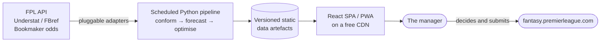

# FPL DOF — Documentation

**FPL DOF** (Fantasy Premier League *Director of Football*) is a personal decision-support platform
for the 2026/27 Fantasy Premier League season: it ingests the data, forecasts what each player is
worth, solves for the best legal squad and transfer plan over a multi-gameweek horizon, and explains
its reasoning well enough to be overruled with confidence.

**Status:** Planning baselined 2026-08-09. No implementation yet — see
[the GW1 decision](02-project-plan-and-blueprint.md#7-the-gw1-decision).

---

## The documents

Read in order. Each builds on the one before.

| # | Document | Answers |
| --- | --- | --- |
| 00 | [Decision Log](00-decision-log.md) | What was decided, and what remains open |
| 01 | [Project Charter](01-project-charter.md) | Why we are building it, what "done" and "successful" mean, and every numbered requirement |
| 02 | [Project Plan and Blueprint](02-project-plan-and-blueprint.md) | The seven design principles, the six build phases, the season calendar, and the RAID log |
| 03 | [Solution Architecture](03-solution-architecture.md) | How it is structured, what it is built with, where it runs, and how it stays free |
| 04 | [Conceptual Design](04-conceptual-design.md) | Every logical component: sources, data layer, models, optimiser, UX, orchestration, testing, observability |
| — | [AI Tooling Plan](ai/README.md) | How Claude Code is configured to build it: `CLAUDE.md`, path-scoped rules, skills, subagents and enforcement hooks |

---

## The shape of it, in one diagram

Scheduled CI jobs do all the work and publish files. A static app reads them. There is no server, no
database and no bill.

---

## Decisions in force

| | |
| --- | --- |
| **Season** | 2026/27 — GW1 deadline 21 Aug 2026 18:30 BST; chip set 1 expires at the GW19 deadline, 2 Jan 2027 |
| **Hosting** | Static site plus scheduled jobs. Zero cost, no operated servers |
| **Stack** | Python for data, modelling and optimisation; TypeScript + React for the web app |
| **Sources** | Official FPL API, Understat/FBref, bookmaker odds — behind a pluggable adapter layer built for future sources |
| **Decision engine** | Multi-gameweek MILP with explicit chip planning |
| **Objective** | Expected points, with a selectable rank-aware risk dial |
| **Users** | Single user, configurable team ID, public endpoints only. No accounts, no credentials |

Full rationale and rejected alternatives in the [Decision Log](00-decision-log.md).

---

## Where to start reading

| If you want to know… | Read |
| --- | --- |
| Whether GW1 is still reachable | [Plan §7](02-project-plan-and-blueprint.md#7-the-gw1-decision) |
| What gets built, in what order | [Plan §3](02-project-plan-and-blueprint.md#3-phase-plan) |
| How it runs for free | [Architecture §4](03-solution-architecture.md#4-the-static-hosting-constraint-and-how-interactivity-survives-it) |
| How the forecast actually works | [Design §5](04-conceptual-design.md#5-analytical-models) |
| How the optimiser is formulated | [Design §6](04-conceptual-design.md#6-decision-engine) |
| How to add a new data source later | [Design §14](04-conceptual-design.md#14-extensibility) |
| What could go wrong | [Plan §6](02-project-plan-and-blueprint.md#6-raid-log) |
