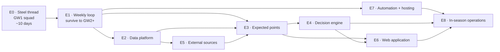

# Implementation Plan — Epics

**Companion to:** the [planning set](../README.md) · **Baselined:** 2026-08-09
**Master clock:** GW1 deadline — **Fri 21 Aug 2026 18:30 BST** = **Sat 22 Aug 03:30 AEST**

---

## 1. The shape of this plan

The build is organised as one **steel thread** followed by eight incremental epics.

> **A steel thread is a thin but complete and working path through every layer of the real
> architecture.** It is not a prototype and not a spike — every line written is kept. It proves the
> architecture end-to-end, delivers real value (a legal, optimised GW1 squad), and leaves every layer
> in place to be thickened later.

This is deliberately *not* the "fast lane" described in
[Plan §7 Track B](../02-project-plan-and-blueprint.md#7-the-gw1-decision), which accepted throwaway
shortcuts. The steel thread costs perhaps a day more and produces no throwaway code, because the
expensive parts of the architecture — adapter isolation, medallion layers, config-driven rules,
versioned contracts — are cheap to put in *first* and expensive to retrofit.



## 2. Epic register

| ID | Epic | Objective served | Target | Est. |
| --- | --- | --- | --- | --- |
| **[E0](E0-steel-thread-gw1.md)** | **Steel thread — GW1 squad** | **OBJ-2** | **21 Aug 2026** | **9–11 d** |
| [E1](E1-weekly-operating-loop.md) | Weekly operating loop | OBJ-3 (minimum viable) | GW2, ~28 Aug | 3–4 d |
| [E2](E2-data-platform.md) | Data platform hardening | OBJ-1, NFR-06/07 | GW6 | 4–6 d |
| [E3](E3-expected-points-engine.md) | Expected points engine | OBJ-1, OBJ-7 | GW10 | 7–10 d |
| [E4](E4-decision-engine.md) | Decision engine | OBJ-3, OBJ-4 | GW15 (chips by GW19) | 6–9 d |
| [E5](E5-external-sources.md) | External data sources | OBJ-1 | GW12 | 4–6 d |
| [E6](E6-web-application.md) | Web application | OBJ-5 | GW14 | 7–10 d |
| [E7](E7-automation-and-hosting.md) | Automation and hosting | OBJ-6, NFR-01/05 | GW8 | 3–5 d |
| [E8](E8-in-season-operations.md) | In-season operations | OBJ-1 | Continuous | ~0.5 d/wk |

**Total build: 43–61 focused days**, against the [plan's original 29–44](../02-project-plan-and-blueprint.md#8-estimation-summary).
The increase is honest, not scope creep: the original estimate assumed a clean sequential build with
no deadline pressure, and this plan adds the steel thread's end-to-end plumbing plus the weekly
operating overhead of running a live season while still building.

## 3. Sequencing rationale

**Why E1 comes before everything else.** Once GW1 is submitted, the season is live and there is a
deadline every week. The single largest risk shifts instantly from "can I build it?" to "can I keep
making defensible decisions every week without it consuming my life?" E1 is small — it extends the
steel thread's optimiser from *pick 15 from scratch* to *given my squad, what is the best transfer?*
— and it is what makes every subsequent week survivable.

**Why E7 (automation) is early-ish.** Because of the timezone. Every FPL deadline falls between
roughly 02:30 and 05:00 AEST for Friday and midweek gameweeks, or around 20:00–21:00 AEST for
standard Saturday ones. The owner cannot be at a keyboard for most deadlines. Manual operation is
viable for a few weeks; it is not viable for 38.

**Why E3 (the real model) is not first.** Tempting, but the steel thread's v0 forecast plus a
working weekly loop already captures most of the available value. A better model multiplies a working
system; it cannot substitute for one.

**Why E5 (external sources) sits behind E3.** Extra data only helps if there is a model good enough
to exploit it. Adding xG before the expected-points chain exists means richer inputs into a cruder
forecast.

## 4. Prioritisation framework

The sequence above is the *starting* rank, not a commitment. It gets re-sorted deliberately.

### The weekly question

> **"What is the biggest regret I would have at the next deadline?"**

Then pick the smallest piece of work that removes it. That question, asked honestly every week, will
outperform any static plan.

### Scoring, when the answer is not obvious

| Factor | Scale | Meaning |
| --- | --- | --- |
| **Deadline regret** | 0–5 | Cost of not having this at the *next* deadline |
| **Season leverage** | 0–5 | How much it compounds across the remaining gameweeks |
| **Confidence** | 0–5 | How sure you are it delivers the value claimed |
| **Cost** | days | Focused build days |

```
priority = (2 × deadline_regret + season_leverage × (gameweeks_left / 38) × 3 + confidence) / cost
```

The `gameweeks_left / 38` term does the important work automatically: in August, compounding
improvements (a better model, more data) outrank convenience; by March, only things that affect the
next few deadlines are worth starting. **After roughly GW30, stop building and just play.**

### Reprioritisation triggers

Re-rank immediately when any of these fire — do not wait for the weekly review.

| Trigger | Effect |
| --- | --- |
| A deadline was missed, or nearly missed | **E7 automation** jumps to the top |
| Data went stale or an adapter broke | **E2 quality gates** jump |
| The model made a visibly bad call twice running | **E3** jumps; consider trusting it less meanwhile |
| GW15 arrives with chips from set 1 unused | **E4 chip planning** becomes urgent — set 1 expires at the GW19 deadline |
| A blank or double gameweek is announced | Fixture-structure handling jumps |
| You spent more than 30 minutes manually researching something | Whatever would have automated that jumps |
| A quality gate blocked publication and you overrode it | Stop. Fix the gate or fix the data — never normalise the override |

### Scheduled decision points

| When | Decision |
| --- | --- |
| **After GW1** | Did the steel thread run end-to-end without manual patching? If not, stabilise before adding anything |
| **After GW4** | Is the recommendation beating your own intuition? If not, prioritise E3 over E6 — a pretty UI on a poor model is worse than no UI |
| **After GW8** | Is manual weekly operation sustainable given the timezone? If not, E7 jumps immediately |
| **Before GW15** | A chip calendar for set 1 must exist. This is a hard, dated constraint |
| **GW19 deadline** | Chip set 1 expires. Unused chips are lost |
| **Mid-season break** | Larger investment: stochastic layer (E3 extension) versus additional sources (E5). Choose one |
| **~GW30** | Stop building. Operate only |

## 5. Guardrails carried from the planning set

These are not renegotiated by the deadline pressure:

1. **Adapter isolation holds from day one** (Invariant 1). It is cheap now and expensive later.
2. **Rules stay config-driven** (Invariant 2), even in the steel thread.
3. **Expected points always carry an uncertainty estimate** (Invariant 6), even when that estimate is
   crude and wide.
4. **The human reviews before every submission** (ASM-6). Non-negotiable in E0 especially, where the
   model is unvalidated.
5. **Every steel-thread shortcut is logged as debt** with a named epic that repays it. See
   [E0 §6](E0-steel-thread-gw1.md#6-technical-debt-register).

### The one principle E0 knowingly breaks

[Blueprint B7](../02-project-plan-and-blueprint.md#b7--validate-before-you-believe) — *validate before
you believe* — cannot be honoured before GW1. There is no time to backtest, and preseason has no
current-season data to backtest against.

**This is accepted deliberately, not overlooked.** The mitigations are specific:

- The GW1 forecast is labelled low-confidence everywhere it appears, with deliberately wide uncertainty.
- The human review gate ([E0-S8](E0-steel-thread-gw1.md#e0-s8--human-verification-gate)) is a
  mandatory story with its own acceptance criteria, not a nice-to-have.
- The squad is sanity-checked against public consensus; eccentric picks require a reason or get overruled.
- Backtesting is the *first* thing E3 delivers, and E3 is scheduled before the model is trusted for
  anything expensive like a −8 hit or a chip.

## 6. What you need to provide

See **[INPUTS-REQUIRED.md](INPUTS-REQUIRED.md)** for the full list with dates, including environment
variables, credentials and the decisions still open. The headline: **the steel thread needs almost
nothing from you** — no API keys, no hosting accounts, no CI setup. It runs locally. The first real
input is your FPL team ID, and that cannot exist until you have created your team.
