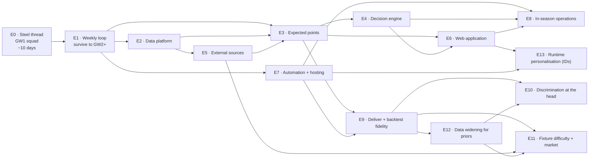

# Implementation Plan — Epics

**Companion to:** the [planning set](../README.md) · **Baselined:** 2026-08-09
**Master clock:** GW1 deadline — **Fri 21 Aug 2026 18:30 BST** = **Sat 22 Aug 03:30 AEST**

---

## 1. The shape of this plan

The build is organised as one **steel thread** followed by eight incremental epics, and then a
**model-improvement programme** of five further epics (E9–E13) that turn the first backtest's finding
into scheduled, gated work — see §7.

> **A steel thread is a thin but complete and working path through every layer of the real
> architecture.** It is not a prototype and not a spike — every line written is kept. It proves the
> architecture end-to-end, delivers real value (a legal, optimised GW1 squad), and leaves every layer
> in place to be thickened later.

This is deliberately *not* the "fast lane" described in
[Plan §7 Track B](../02-project-plan-and-blueprint.md#7-the-gw1-decision), which accepted throwaway
shortcuts. The steel thread costs perhaps a day more and produces no throwaway code, because the
expensive parts of the architecture — adapter isolation, medallion layers, config-driven rules,
versioned contracts — are cheap to put in *first* and expensive to retrofit.



E9–E13 are a second wave, not a continuation of the first sequence: they begin from the
[Model Improvement Plan](../05-model-improvement-plan.md) and the [DL-21](../00-decision-log.md#dl-21)
finding, and E9 gates the three modelling epics behind it (§7).

## 2. Epic register

| ID | Epic | Objective served | Target | Est. |
| --- | --- | --- | --- | --- |
| **[E0](E0-steel-thread-gw1.md)** | **Steel thread — GW1 squad** | **OBJ-2** | **21 Aug 2026** | **9.5–11.5 d** |
| [E1](E1-weekly-operating-loop.md) | Weekly operating loop | OBJ-3 (minimum viable) | GW2, ~28 Aug | 3.5–4.5 d |
| [E2](E2-data-platform.md) | Data platform hardening | OBJ-1, OBJ-4, NFR-06/07 | GW6 | 4.5–6.5 d |
| [E7](E7-automation-and-hosting.md) | Automation and hosting | OBJ-6, NFR-01/05 | GW8 | 3–5 d |
| [E3](E3-expected-points-engine.md) | Expected points engine | OBJ-1, OBJ-7 | GW10 | 7–10 d |
| [E5](E5-external-sources.md) | External data sources | OBJ-1 | GW12 | 4–6 d |
| [E4](E4-decision-engine.md) | Decision engine | OBJ-3, OBJ-4 | GW15 (chips expire GW19) | 7–10 d |
| [E6](E6-web-application.md) | Web application | OBJ-5 | GW16 | 7–10 d |
| [E8](E8-in-season-operations.md) | In-season operations | OBJ-1 | Continuous | ~0.5 d/wk |
| **[E9](E9-forecast-delivery-and-backtest-fidelity.md)** | **Forecast delivery + backtest fidelity** | OBJ-1, OBJ-7 | first of the programme | 2–3 d |
| [E10](E10-discrimination-at-the-head.md) | Discrimination at the head | OBJ-1, OBJ-7 | after E9 | 6–9 d |
| [E11](E11-fixture-difficulty-and-market-signal.md) | Fixture difficulty + market signal | OBJ-1 | after E9 | 5–7 d |
| [E12](E12-data-widening-for-priors.md) | Data widening for priors | OBJ-1 | feeds E10/E11 | 3–4 d |
| [E13](E13-runtime-personalisation-ids.md) | Runtime personalisation (team/league IDs) | OBJ-5 | independent | 2–3 d |

**Total build: 46–64 focused days**, against the [plan's original 29–44](../02-project-plan-and-blueprint.md#8-estimation-summary).
The increase is honest, not scope creep: the original estimate assumed a clean sequential build with
no deadline pressure, and this plan adds the steel thread's end-to-end plumbing plus the weekly
operating overhead of running a live season while still building.

**E6 moved from GW14 to GW16.** It was previously targeted *before* E4, one of its own dependencies.

### What these targets assume — and it is demanding

The dates only mean something against a rate, which until 2026-08-09 was never written down. It was
originally set as **[ASM-8](../01-project-charter.md#8-assumptions): 3–4 focused build days per
week**, on top of the ~0.5 day/week operating loop.

Do the arithmetic against that assumption: the sequence to GW15 totals roughly **60 focused days
across 15 calendar weeks**. That is four days a week, every week, with no allowance for illness,
travel, a work crunch, or an E3 that needs a second attempt.

**[DL-23](../00-decision-log.md#dl-23--build-pace-is-roughly-an-order-of-magnitude-faster-than-asm-8-assumed)
found this assumption was wrong in the favourable direction.** E0 through E3 — an estimated
25–32.5 focused days of scoped work — landed across three calendar days (2026-08-09 to 08-11). The
targets below are retained as **ceilings, not the binding constraint**: at this pace, build time is
not what paces the remaining epics. What paces them now is the **season clock and evidence** — E3's
model quality finding ([DL-21](../00-decision-log.md#dl-21--the-v1-forecast-beats-price-and-loses-to-recent-form-reported-not-tuned))
can only be resolved by watching real gameweeks resolve, which does not compress with build speed.
**No epic should be rushed to hit a stale date, and none should start before its dependencies'
findings are addressed, regardless of how much calendar time is left** (see D-13 in
[E0 §6](E0-steel-thread-gw1.md#6-technical-debt-register), and the gate now written into
[E4 §0](E4-decision-engine.md#0-gate-carried-in-from-e3--read-before-starting)).

**If a human build pace ever becomes the operative constraint again** (this tooling changes, or the
work shifts back to manual effort), ASM-8's original 3–4 days/week arithmetic above is still the
number to re-apply.

**One thing must not absorb the slippage.** Chip set 1 expires at the GW19 deadline and cannot be
recovered. E4 is last and depends on E3, making it structurally the most exposed item in the plan —
so that exposure is decoupled deliberately: a blunt
[chip-expiry tracker](E2-data-platform.md#e2-s7--chip-expiry-tracker--05-day--obj-4) ships in **E2**,
around GW6, months before the real optimiser. Half a day of insurance against a dated, irreversible
loss that would otherwise depend on two large epics both landing on time.

## 3. Sequencing rationale

**Why E1 comes before everything else.** Once GW1 is submitted, the season is live and there is a
deadline every week. The single largest risk shifts instantly from "can I build it?" to "can I keep
making defensible decisions every week without it consuming my life?" E1 is small — it extends the
steel thread's optimiser from *pick 15 from scratch* to *given my squad, what is the best transfer?*
— and it is what makes every subsequent week survivable.

**Why E7 (automation) is early-ish.** Because of the timezone. Every FPL deadline falls between
roughly 02:30 and 05:00 AEST for Friday and midweek gameweeks, or around 20:00–21:00 AEST for
standard Saturday ones. The owner cannot be at a keyboard for most deadlines. Manual operation is
viable for a few weeks; it is not viable for 38.

**Why E3 (the real model) is not first.** Tempting, but the steel thread's v0 forecast plus a
working weekly loop already captures most of the available value. A better model multiplies a working
system; it cannot substitute for one.

**Why E5 (external sources) sits behind E3.** Extra data only helps if there is a model good enough
to exploit it. Adding xG before the expected-points chain exists means richer inputs into a cruder
forecast.

## 4. Prioritisation framework

The sequence above is the *starting* rank, not a commitment. It gets re-sorted deliberately.

**The cadence below assumes weekly human review.** [DL-23](../00-decision-log.md#dl-23--build-pace-is-roughly-an-order-of-magnitude-faster-than-asm-8-assumed)
found the actual build rate makes "weekly" the wrong unit — re-read this section **before starting
each epic**, not on a calendar timer. The content (the question, the scoring formula, the triggers)
is unchanged and still holds.

### The weekly question

> **"What is the biggest regret I would have at the next deadline?"**

Then pick the smallest piece of work that removes it. That question, asked honestly every week, will
outperform any static plan.

### Scoring, when the answer is not obvious

| Factor | Scale | Meaning |
| --- | --- | --- |
| **Deadline regret** | 0–5 | Cost of not having this at the *next* deadline |
| **Season leverage** | 0–5 | How much it compounds across the remaining gameweeks |
| **Confidence** | 0–5 | How sure you are it delivers the value claimed |
| **Cost** | days | Focused build days |

```
priority = (2 × deadline_regret + season_leverage × (gameweeks_left / 38) × 3 + confidence) / cost
```

The `gameweeks_left / 38` term does the important work automatically: in August, compounding
improvements (a better model, more data) outrank convenience; by March, only things that affect the
next few deadlines are worth starting. **After roughly GW30, stop building and just play.**

### Reprioritisation triggers

Re-rank immediately when any of these fire — do not wait for the weekly review.

| Trigger | Effect |
| --- | --- |
| A deadline was missed, or nearly missed | **E7 automation** jumps to the top |
| Data went stale or an adapter broke | **E2 quality gates** jump |
| The model made a visibly bad call twice running | **E3** jumps; consider trusting it less meanwhile |
| GW15 arrives with chips from set 1 unused | **E4 chip planning** becomes urgent — set 1 expires at the GW19 deadline |
| A blank or double gameweek is announced | Fixture-structure handling jumps |
| You spent more than 30 minutes manually researching something | Whatever would have automated that jumps |
| A quality gate blocked publication and you overrode it | Stop. Fix the gate or fix the data — never normalise the override |

### Scheduled decision points

| When | Decision |
| --- | --- |
| **After GW1** | Did the steel thread run end-to-end without manual patching? If not, stabilise before adding anything |
| **After GW4** | Is the recommendation beating your own intuition? If not, prioritise E3 over E6 — a pretty UI on a poor model is worse than no UI |
| **After GW8** | Is manual weekly operation sustainable given the timezone? If not, E7 jumps immediately |
| **Before GW15** | A chip calendar for set 1 must exist. This is a hard, dated constraint |
| **GW19 deadline** | Chip set 1 expires. Unused chips are lost |
| **Mid-season break** | Larger investment: stochastic layer (E3 extension) versus additional sources (E5). Choose one |
| **~GW30** | Stop building. Operate only |

## 5. Guardrails carried from the planning set

These are not renegotiated by the deadline pressure:

1. **Adapter isolation holds from day one** (Invariant 1). It is cheap now and expensive later.
2. **Rules stay config-driven** (Invariant 2), even in the steel thread.
3. **Expected points always carry an uncertainty estimate** (Invariant 6), even when that estimate is
   crude and wide.
4. **The human reviews before every submission** (ASM-6). Non-negotiable in E0 especially, where the
   model is unvalidated.
5. **Every steel-thread shortcut is logged as debt** with a named epic that repays it. See
   [E0 §6](E0-steel-thread-gw1.md#6-technical-debt-register).
6. **Exceptions to the definition of done are dated and written down.** E0 runs without CI, which
   charter §13.3 requires — covered by a
   [single-use carve-out](../01-project-charter.md#the-one-dated-exception--e0) expiring 22 August,
   logged as debt D-10 and repaid by E7. No further exceptions without a decision-log entry.

### The one principle E0 knowingly breaks

[Blueprint B7](../02-project-plan-and-blueprint.md#b7--validate-before-you-believe) — *validate before
you believe* — cannot be honoured before GW1. There is no time to backtest, and preseason has no
current-season data to backtest against.

**This is accepted deliberately, not overlooked.** The mitigations are specific:

- The GW1 forecast is labelled low-confidence everywhere it appears, with deliberately wide uncertainty.
- The human review gate ([E0-S8](E0-steel-thread-gw1.md#e0-s8--human-verification-gate)) is a
  mandatory story with its own acceptance criteria, not a nice-to-have.
- The squad is sanity-checked against public consensus; eccentric picks require a reason or get overruled.
- Backtesting is the *first* thing E3 delivers, and E3 is scheduled before the model is trusted for
  anything expensive like a −8 hit or a chip.

## 6. What you need to provide

See **[INPUTS-REQUIRED.md](INPUTS-REQUIRED.md)** for the full list with dates, including environment
variables, credentials and the decisions still open. The headline: **the steel thread needs almost
nothing from you** — no API keys, no hosting accounts, no CI setup. It runs locally. The first real
input is your FPL team ID, and that cannot exist until you have created your team.

Hosting is no longer among the open questions: [DL-12](../00-decision-log.md#dl-12--public-repository)
made the repository public, which closes both OD-01 and OD-02 and puts the site on GitHub Pages for
free. The one thing it asks in return is vigilance — every push is world-readable, so NFR-13 stops
being precautionary.

## 7. The model-improvement programme (E9–E13)

E0–E8 built the system and revealed, through the first backtest
([DL-21](../00-decision-log.md#dl-21)), *where the forecast is weak and why*. The
[Model Improvement Plan](../05-model-improvement-plan.md) turned that finding into a prioritised set
of falsifiable experiments; **E9–E13 are those experiments scheduled as epics** and recorded in
[DL-45](../00-decision-log.md#dl-45). Nothing here promotes by argument — every modelling change
clears the [E8 §5 bar](E8-in-season-operations.md#5-the-bar-for-changing-the-model-mid-season):
held-out backtest improves, six shadow gameweeks do not degrade, explicable in advance.

### Where the plan's items live

| Plan item | Epic |
| --- | --- |
| **X1** ship `xp_v1` live (close D-25) · **D1** fixtures into the backtest | **[E9](E9-forecast-delivery-and-backtest-fidelity.md)** |
| **X2** minutes (close D-14) · **X3** anti-shrinkage · **X4** penalty term · **X5** goalkeeper · **X6** monolith shadow | [E10](E10-discrimination-at-the-head.md) |
| **F1–F5** fixture ratings, home advantage, opponent-adjusted rates, promoted priors, market blend · **D3** odds live | [E11](E11-fixture-difficulty-and-market-signal.md) |
| **D2** DefCon history (Q-13) · **D4** penalty reference table · **D5** prior-season prior re-measured | [E12](E12-data-widening-for-priors.md) |
| **§7** UI-entered, never-persisted team/league IDs (DL-44) | [E13](E13-runtime-personalisation-ids.md) |

### The one gate that orders the programme

**E9 is first and it gates E10, E11 and E12.** Two of its items are not modelling changes — they are
the seams that make every other item real: the model that is *graded* must be the model that is
*shipped* (X1/D-25), and the backtest must be able to *see fixtures* (D1). While either is unmet, the
other epics measure things they cannot deliver and cannot test. This is the same "measurement before
the thing it measures" discipline E4 inherited from E3.

The leverage order within the programme, and the gate on each change, is
[Model Improvement Plan §8](../05-model-improvement-plan.md#8-sequencing-and-gates). **E13 is
independent** — it shares no dependency with the model epics and can be built whenever convenient
after E6/E7.

### How this interacts with the prioritisation framework (§4)

The programme does **not** override the weekly question — *"what is the biggest regret at the next
deadline?"*. In-season, an E7 automation gap or an E4 chip deadline still outranks a discrimination
experiment. E9–E13 are the answer to *"what should I build when nothing is on fire?"*, ranked by
leverage; E9 aside, none is urgent against a dated constraint, and after ~GW30 the framework's "stop
building and just play" rule applies to them too.
